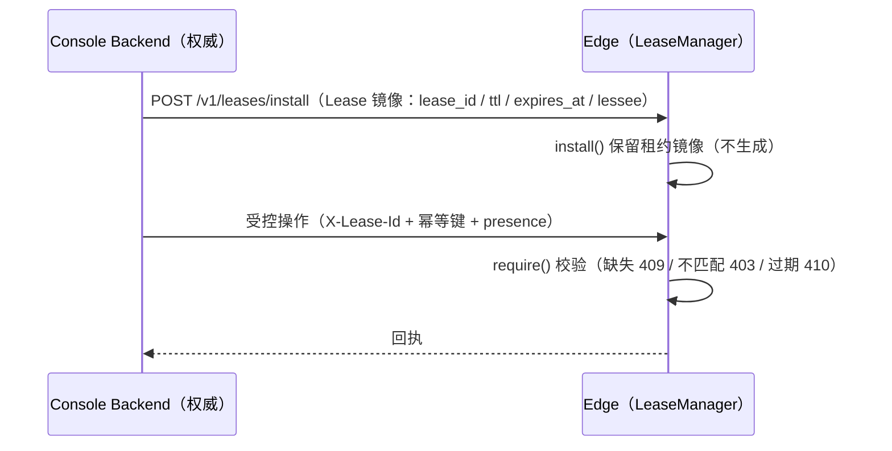

# Edge 级租约（lease）

## 摘要

租约是 **Edge 层级的独立授权机制**，独立于机器人 / 任务（`lease/`，`LeaseManager` 单点管理、
线程安全）。**租约权威在 Console**：Console Backend **生成 Lease**（`lease_id` / `ttl` /
`expires_at`），经 `POST /v1/leases/install` 把租约**镜像**部署到 Edge；Edge **只保留 + 校验**
（`LeaseManager.install` / `require`），**不生成租约**。受控操作（进入 / 控制任务、
`/v1/commands` 含 estop）须携带匹配租约（`X-Lease-Id`），由 Edge 校验后放行。

> 当前 `/v1/leases/activate · renew · release`（Edge 自生成租约）为**本地测试占位**：暂时代替
> Console 签发 / 管理租约，仅供开发 / 联调 / 前端测试（Console 尚未接入）；权威模型下由
> Console 侧管理，Edge 收敛为仅 `install` + `require`。

## 数据流（正确模型）



## 目标与原则

-   **权威在 Console**：Lease 由 Console 生成并下发镜像；Edge **不生成** lease_id，只
    `install` 保留 + `require` 校验。
-   **单活跃租约**：Edge 同一时刻至多持有一个；已有活跃租约时再 `install` → `409`。
-   **租约独立于任务**：session **只消费（校验）租约**，不产生 / 销毁。
-   **续租（心跳）**：Console 定时 `renew`（建议间隔 `renew_interval`，默认 60s）并更新镜像；
    `ttl`（默认 120s）内未续租则租约失效（410），需重新签发。
-   **单点校验**：访问校验（`require`）由 `LeaseManager` 实现；Service 只调用
    `leases.require()`，不复制逻辑。
-   **撤销（Edge 内部）**：`revoke` 无参、幂等、不暴露 HTTP（节点异常 / 安全事件时强制撤销）。

## 租约生命周期

```
无租约 ──install（Console 签发镜像）──▶ ACTIVE ──renew（Console 更新镜像）──▶ ACTIVE
                       │
                       ├──release──▶ 无租约（Console 释放）
                       ├──revoke────▶ 无租约（Edge 内部撤销）
                       └──expires_at 到期──▶ EXPIRED（受控操作拒绝，可重新签发）
```

`LeaseState`：`ACTIVE` / `EXPIRED` / `RELEASED` / `REVOKED`。过期租约保留为 `expired` 状态
（`leasable=true`）。

## 契约

### Console → Edge（部署租约镜像）

| 方法 | 路径                 | 请求体 / 头                                 | 返回                             |
| ---- | -------------------- | ------------------------------------------- | -------------------------------- |
| POST | `/v1/leases/install` | body `{lease_id, ttl, expires_at, lessee?}` | `{status, lease_id, expires_at}` |

`POST /v1/leases/install`（**正确模型入口**：Console 签发租约 → Edge 存储镜像，不生成）：

```json
{ "lease_id": "ls_console_issued", "ttl": 120, "expires_at": "2030-01-01T00:00:00+08:00", "lessee": "console" }
```

### 状态（只读）

| 方法 | 路径         | 返回                                                               |
| ---- | ------------ | ------------------------------------------------------------------ |
| GET  | `/v1/leases` | `{lease_id?, state, expires_at?, ttl?, renew_interval?, leasable}` |

时间统一使用**北京时间**（`Asia/Shanghai`）。

### 受控操作（Edge 校验）

`POST /v1/captures` / `DELETE /v1/captures`、`POST /v1/infers` / `DELETE /v1/infers`、
`GET /v1/preview`、`POST /v1/webrtc/offer`、`POST /v1/commands`（全部）——须携带匹配的
`X-Lease-Id`，Edge 经 `LeaseManager.require` 校验。

### 本地测试占位（暂时代替 Console）

Console 尚未接入时，`POST /v1/leases/activate · renew · release` 由 Edge 本地 `LeaseManager`
**暂时代替 Console** 签发 / 续租 / 释放（Edge 自生成 lease_id），**仅供开发 / 联调 / 前端测试**；
权威模型下由 Console 侧管理，Edge 收敛为仅 `install` + `require`。

## 错误语义

-   `401` / `403`：缺失 / 不匹配租约（`lease mismatch`）。
-   `409`：`install` 时已有活跃租约；`release` 无活跃租约；`require` 无活跃租约（先 install）。
-   `410 Gone`：租约已过期（`lease expired`，即使 lease_id 不匹配也优先报 410）。

## 配置（lease 段）

```yaml
lease:
    ttl: 120 # 租约有效期（秒）：Console 签发租约的默认有效期
    renew_interval: 60 # 建议续租间隔（秒）：Console 按此定时续租
```

## 相关文档

-   会话消费租约：[会话（session）](./motrix_edge_session.md)
-   HTTP 端点注册：[HTTP 控制面（server）](./motrix_edge_server.md)
-   代码入口：`src/motrix_edge/lease/` —— 随 **feat/3**（HTTP 控制面）落地
