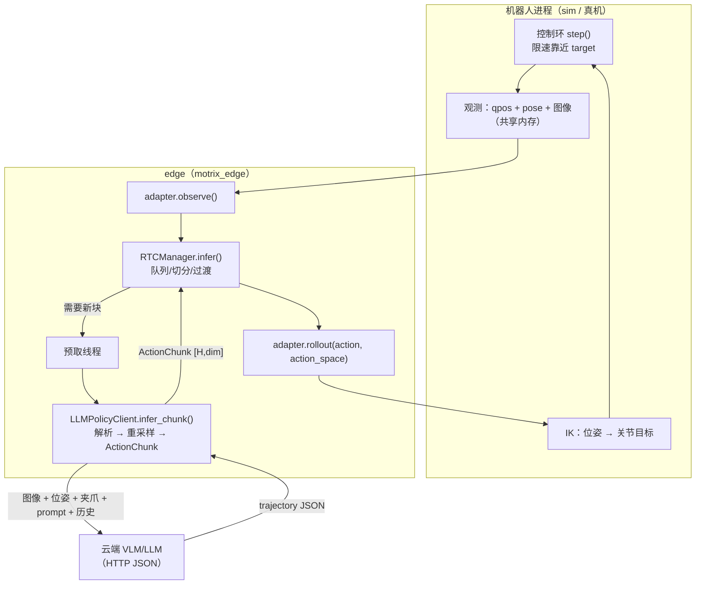

# LLM 轨迹策略（policy/llm）

## 摘要

`policy/llm` 是用**云端 VLM/LLM** 依据「相机图像 + 机器人状态」直接生成**笛卡尔轨迹点序列**的
策略客户端，作为 `policy.type: llm` 与 [openpi / act](./motrix_edge_policy.md) 并列注册。

职责边界（与既有分包原则一致）：

| 层                   | 职责                                                                     |
| -------------------- | ------------------------------------------------------------------------ |
| LLM（外部服务）      | 给出**稀疏笛卡尔轨迹**（waypoint + 时间），表达高层意图                  |
| `policy/llm`（edge） | 组装观测 / 调模型 / 解析校验 / **重采样成控制步动作块**（`ActionChunk`） |
| `rtc`（edge）        | 块缓存 / 三元切分 / 过渡 / **异步预取**（吸收 LLM 往返延迟）             |
| adapter → robot 进程 | **笛卡尔 → 关节的 IK**、限速、限位（运动学归机器人侧，edge 不持有）      |

## 目标与成功标准

-   任务：叠方块（把方块抓起并叠放到目标方块上方）；场景由相机布局 + 任务 prompt 描述。
-   延迟：单次 LLM 往返 $L \approx 1\text{–}3\text{s}$，控制环仍**连续运动不中断**——由
    RTC 异步预取 + 轨迹覆盖时长吸收，约束见 [频率与延迟预算](#频率与延迟预算)。
-   鲁棒：解析失败 / 超时 / 服务不可用**不升级为任务错误**（本步跳过，机械臂保持当前目标），
    急停与退出路径与既有策略完全一致。
-   可观测：轨迹、解析结果、推导出的块长经 `rtc.status()` / `/v1/infers` 上报，前端可见。

## 整体原则

1. **LLM 出轨迹、不出高频单点**：轨迹点是高层意图（笛卡尔直线段 / 停留点），控制步上的密集
   目标由 edge **重采样**产生——LLM 的调用频率不必等于控制频率。
2. **运动学归机器人侧**：笛卡尔位姿 → 关节角的 IK 由 adapter / 机器人进程承担（真机由机器人
   SDK 提供，模拟由模拟运动学提供）；edge 契约只承载位姿，不解释机器人结构。
3. **动作块语义复用 rtc**：重采样后的轨迹 = `[H, dim]` 动作块，块缓存 / 切分 / 过渡 / 预取
   全部复用 [rtc](./motrix_edge_rtc.md)，策略侧不新增任何块管理逻辑。
4. **契约单点定义**：观测键 / 动作空间 / HTTP 字段分别在 `adapter/base.py`、
   `adapter/shm_contract.py`、`adapter/http_contract.py` 定义，两端引用不硬编码。
5. **密钥只存内存态**：API key 由调用方运行时给出（前端表单 / `infer config set`，配置项 `api_key`
   标记 `secret`），只写 edge 内存态——**不落盘、不回显**（状态查询与命令回执一律脱敏为 `***`，
   日志同样脱敏）。留空时回退**环境变量**（默认 `OPENAI_API_KEY`，变量名可经 `edge.yml` 的
   `policy.api_key_env` 改名——该键**不是表单项**，不出现在前端 / `infer config` 里）。

## 拓扑



## 轨迹协议（LLM 输出）

模型返回一个 JSON 对象；`trajectory` 为**稀疏轨迹点**列表：

```json
{
    "reasoning": "抓取右侧方块并叠放到左侧方块上方",
    "trajectory": [
        { "t": 0.0, "arm": "right", "pos": [0.32, -0.05, 0.18], "rot": [3.14, 0.0, 0.0], "gripper": 0.0 },
        { "t": 0.8, "arm": "right", "pos": [0.32, -0.05, 0.09], "rot": [3.14, 0.0, 0.0], "gripper": 0.0 },
        { "t": 1.2, "arm": "right", "pos": [0.32, -0.05, 0.09], "rot": [3.14, 0.0, 0.0], "gripper": 1.0 }
    ]
}
```

字段语义（**单点定义**，解析与校验实现在 `policy/llm/trajectory.py`）：

| 字段       | 单位 / 取值                    | 规则                                                               |
| ---------- | ------------------------------ | ------------------------------------------------------------------ |
| `t`        | 秒（相对本块起点）             | 单调不减，首点 `t=0`；缺失时按等间隔均匀铺开                       |
| `arm`      | 臂名（`ARM_NAMES` 之一）       | 单臂布局可省略；**多臂布局必填**（缺失 / 未知臂名 → 整块判为非法） |
| `pos`      | 米（机器人基座坐标系）         | 长度 3；缺失 → 整块非法                                            |
| `rot`      | 弧度（欧拉角，序由机器人声明） | 长度 3；缺失 → 沿用上一点姿态                                      |
| `gripper`  | `[0, 1]` 归一化开合            | 缺失 → 沿用上一点；越界 → 裁剪（策略输出无界属常态）               |
| 点数       | `1 ≤ N ≤ max_points`           | 超出 → 截断到前 `max_points` 点并告警                              |
| 未出现的臂 | —                              | 保持当前目标（该臂不下发新指令，等价于「只动一条臂」）             |

模型输出是**不可信输入**：容忍 ```代码块包裹与前后解释文字（取首个 JSON 对象），
任何维度 / 类型 / 单调性错误 → 整块判非法（返回`None`，不下发）。

## 客户端行为（LLMPolicyClient）

-   **观测组装**（每次请求）：启用相机（JPEG → base64，`image_size` 缩放省带宽）+ **末端位姿与
    夹爪**（每臂一行：`pose_pos` / `pose_rot` / `gripper`；**关节角不下发**——笛卡尔策略的
    输入空间是位姿，关节值对模型无信息量，白花 token）+ 任务 `prompt` + **历史摘要**。布局
    （启用相机 / 臂 / 维度）一律来自会话注入的 `bind_adapter`，不另读 `edge.yml`。
-   **记忆**：最近 `history_len` 轮以**结构化摘要**回灌（每臂一段：「起点 → 终点 + 夹爪变化」，
    全程不动记为 `held at`），**不回传历史图像、不回灌模型原始输出**（避免被截半，长度只随臂数
    增长）；`reset()` 清空（会话复位）。
-   **截断告警**（均打 WARNING，不中断）：模型轨迹点数超 `max_points`（截尾部）；响应被
    `max_tokens` 截断（`finish_reason=length`）；历史条目超 `HISTORY_ENTRY_MAX`（截断）。
-   **重采样**：轨迹点 → 控制步密集块 `[H, dim]`：位置 / 姿态在相邻点间**线性插值**，
    夹爪按分段常数（开关型执行器，插值无意义）；`H = horizon`（配置），时间轴按
    `infer_freq` 离散化。
-   **失败策略**：HTTP 错误 / 超时 / 解析失败 / 校验失败 → `infer_chunk` 返回 `None`
    （RTC 计入 `failed_chunks`，本步跳过、机械臂保持当前目标，不升级为任务错误）。
-   **限幅**：相邻输出步的最大笛卡尔位移 `max_pose_step`（米）；超限则整块按比例缩放——
    防止模型给出跨越工作空间的跳变指令（关节限位仍由机器人侧兜底）。
-   **预热**（`prepare`）：首次发一帧观测触发 TLS 握手 / 连接池建立，丢弃结果。

## 契约扩展（观测 / 动作空间）

### 观测：`observations/pose`

末端位姿（**每臂 6 维：xyz + rpy**，顺序同 `ARM_NAMES`，单位米 / 弧度）。笛卡尔动作必须配
笛卡尔观测——否则模型不知道自己末端在哪。`qpos` / `pose` / `action` 三个状态区并列。

### 动作空间：`ActionSpace`

| 取值             | 维度（每臂） | 语义                      | 使用者       |
| ---------------- | ------------ | ------------------------- | ------------ |
| `joint`（缺省）  | 7            | 关节角 + 夹爪（绝对目标） | openpi / act |
| `cartesian_pose` | 7            | 位姿（xyz+rpy）+ 夹爪     | `llm`        |

-   策略侧：`BasePolicyClient.action_space`（类属性，`llm` 覆盖为 `cartesian_pose`）。
-   会话侧：`InferSession` 把策略声明的动作空间透传给 `adapter.rollout(action, action_space=None)`。
-   适配器侧：`RobotAdapter.ACTION_SPACES` 声明**支持**的空间（`RobotCapabilities.action_spaces`
    上报）；不支持的请求 → `ValueError`（调用方回执拒绝），机器人进程再校验一次（不可信输入的最后一关）。
-   HTTP：`/v1/rollout` body 增 `action_space` 字段（缺省 = `joint`，**向后兼容**——不发的调用方
    行为不变）。

### 共享内存布局

`pose_dim` 区域紧随 `action` 区之后；`pose_dim=0`（机器人不提供位姿）时布局与版本保持
**v2 不变**（既有机器人进程无需改动）；`pose_dim>0` → 版本 3，读者据此暴露位姿。
读者侧 `read()` 仅在位姿存在时返回 `observations/pose`，adapter `observe()` 相应带上该键。

## 频率与延迟预算

记 $L$ = 一次 LLM 往返 + 解析耗时（`rtc.status().last_delay` 可观测），$f$ = `infer_freq`，
则**一次推理期间走过的步数** $L \cdot f$ 是这套配置里唯一的“硬通货”（rtc 语义见
[实时动作块（rtc）](./motrix_edge_rtc.md)：预取在剩余步数 $\le P + S$ 时发起，到达时
$\text{age} = L \cdot f$ 步已被 `_prefix_len` 自动跳过）。

| 约束               | 条件                  | 不满足时的现象                                  |
| ------------------ | --------------------- | ----------------------------------------------- |
| 块内有可执行步     | $H > L \cdot f$       | 整块落在过去 → `stale_chunks++`（白花一次调用） |
| 连续运动（无停顿） | $P + S \ge L \cdot f$ | 队列耗尽 → 该步无动作 → 机械臂停住              |

**$L$ 为几十秒的 demo 有两种范式：**

1. **停走式（stop-and-go，推荐给高延迟 demo）**：$S = 0$、$E = H$、`aggregate_fn: latest_only`，
   $f = 2\text{–}5$ Hz、$H = 10\text{–}20$。行为 = 每块执行 $H/f$ 秒 → **队列空时在会话线程内联
   推理**（阻塞 $L$）→ 下一块从当前步继续。轨迹被完整执行（无过期步、无融合），每次停顿都是
   天然的“重拍 / 换 prompt”检查点；代价是运动不连续。
2. **连续流**：$P + S \ge L \cdot f$ 且 $H > L \cdot f$（两侧都要留 margin）。例：$L = 30\text{s}$、
   $f = 1\text{Hz}$ → $S \ge 30$、$H \ge 40$，且模型产出的轨迹时间跨度要覆盖 $H/f$ 秒。
   预取全在 rtc 工作线程，控制环不阻塞。代价：token 多、单块开环时间长。

无论哪种，**感知 → 动作的总滞后 = $L$ + 块开环时长**，段越短越安全。RTC 只能隐藏 $L$ 的一部分：
当 $L$ 超过块时长时，异步预取无法消除停顿，最多让停顿更短。

### $L$ 不可预测（抖动）时的影响

rtc 按**绝对步号**对齐，所以“什么时候返回”不改变动作对齐（晚到不会让机械臂往回走或跳变），
它只决定**这一块还剩多少步可用**（$\text{age} = L \cdot f$）：

-   $\text{age} < H$：前缀 $\text{age}$ 步被跳过，本块实际可执行 $H - \text{age}$ 步；返得越晚，
    可用步越少、越快又需要下一次推理（**停滞自我放大**）。
-   $\text{age} \ge H$：整块过期丢弃（`stale_chunks++`），本次调用 token 白花，该步无动作 →
    这一轮**不可恢复地停住**（下次 `infer` 才重新发起，且此时无在途请求 → 走内联分支再等一次 $L$）。
-   **单飞**：在途期间不发起新请求，进程侧也不排队——**慢一次就是整段时间没有新块**，不会被后续请求补偿。
-   停顿时机械臂保持最后指令目标；新块首个可用步 = 计划中此刻该在的位置，所以停顿后会出现一段
    **以 `step_rad` 限速上限追赶**的运动（有界，不跳变）。
-   $S > 0$ 时重叠融合量随到达时刻变化 → 同一段轨迹在不同到达时刻的执行形状不同（**可复现性差**）：
    延迟不确定时优先 $S = 0$ / `latest_only`。
-   阻塞时机不可预测：$S = 0$ 时“队列空 → 内联”分支何时进入取决于返回时机，因此**急停 / 命令
    响应窗口的上界由最坏延迟决定**。

应对：用 `policy.timeout` 给 $L$ 设**上界**（超时等同失败 → `None`，行为可预期，建议取典型
延迟的 2 倍）；$H$ 按**最坏**延迟设计（$H > L_{\max} \cdot f$），或反过来把块做**短**、明确接受
停走（避免整块过期白花 token）；演示时用 `infer rollout` 单步，等待时长由人直接感知，执行完
立刻回到命令循环。

**单步 `infer rollout` 也走 rtc**：它不是“每次点击 = 一次推理”——首次点击触发推理并缓存整块，
后续点击只是**逐步消费缓存**（不调模型），直到队列耗尽才再推理一次。要「每次点击都重新推理」
把 `horizon` 设为 `1` 即可（仍走 rtc，保留过期保护与 status 上报）。判断某次点击会不会真的
调模型：看 `infer rtc` 的 `remaining`（> 0 则不会）。
另外单步模式下**时间轴由点击节奏决定**：轨迹点按“点一下走一个点”执行（点得慢则走得慢，
目标仍是绝对位姿，不会累积漂移），模型给的 `t` 退化为相对顺序。

⚠️ **内联推理会阻塞会话主循环**：停走式下那次阻塞发生在 `InferSession` 的 run 循环里，
`session quit` / `robot estop` 由该循环消费命令 → **阻塞期间不响应**（$L$ 秒）。demo 中若需要
随时急停，改用 `infer rollout` 单步（调用方本就预期一次阻塞），或把 $S$ 设到覆盖 $L \cdot f$
走连续流；后续若要做真机长延迟策略，应把急停做成不经会话循环的旁路。

本策略**不使用 rtc 的退化模式**（`enabled = false`：每次调用一次推理、只取块首点）：每次调用都付
一次 $L$ 与一份 token，且块内其余路点被丢弃。要“一次推理买一小段连续运动”就用停走式
（$S = 0$），要用预取隐藏 $L$ 才需要连续流。

调参看 `infer rtc` 的 `remaining` / `inflight` / `last_delay_steps` / `stale_chunks` /
`failed_chunks`：`stale_chunks` 增长 = $H$ 被 $L$ 吃掉，`last_delay_steps` 就是 $L \cdot f$ 的实测值。

## 配置（`policy` 段 + `POLICY_CONFIG_ITEMS["llm"]`）

配置项静态声明在 `policy/__init__.py`，CLI（`infer config`）与前端（按 schema 渲染表单）共用；
**不写 `edge.yml` 也能跑**（代码缺省）。必填项仅 `base_url` 与 `model`。

| 配置键          | 类型 | 缺省                        | 说明                                                              |
| --------------- | ---- | --------------------------- | ----------------------------------------------------------------- |
| `base_url`      | text | `https://api.openai.com/v1` | OpenAI 兼容端点（`POST {base_url}/chat/completions`）             |
| `model`         | text | —（必填）                   | 模型名（如 `gpt-4o` / `qwen-vl-max`）                             |
| `api_key`       | text | —                           | **前端输入**（`secret`：仅内存态，不落盘 / 不回显，刷新后需重填） |
| `timeout`       | int  | 30                          | 单次请求超时（秒）                                                |
| `temperature`   | int  | 0                           | 采样温度（控制任务取 0）                                          |
| `max_tokens`    | int  | 1024                        | 响应上限                                                          |
| `horizon`       | int  | 15                          | 重采样后的块长 H（步）                                            |
| `image_size`    | int  | 768                         | 下发图像的**最长边**（等比缩放，省带宽 / token）                  |
| `history_len`   | int  | 3                           | 回灌的历史轮数（文本摘要）                                        |
| `max_points`    | int  | 32                          | 轨迹点数上限（超出截断）                                          |
| `max_pose_step` | int  | 0.05                        | 相邻输出步最大笛卡尔位移（米）；超限整块缩放                      |
| `system_prompt` | text | 内置                        | 系统提示（输出格式约定），可覆盖                                  |

端点 `host` / `port` 公共项对 `llm` 无意义（走 `base_url`），沿用同一 schema 但留空即可。

## 安全与边界

-   **不可信输出**：维度 / 类型 / 单调性 / 点数 / 幅值全部校验后才下发；越界只裁剪不放大。
-   **IK 失败**：机器人侧拒绝该步（保持原目标）；edge 记日志、不重试、不中断任务。
-   **限速不变**：`step()` 的 `step_rad` 限速与关节限位是最终保护，与策略无关。
-   **急停**：`robot estop` → `safe_stop()` 路径不变；LLM 请求在预取线程，`rtc.close()`
    使在途结果按世代作废，不会在急停后落块。
-   **失败安全**：任何解析 / 网络异常都退化为「不下发」，机械臂保持当前目标而非乱动。

## 未决项（Phase 2 前确认）

1. **真机 IK 能力**：`pyAgxArm` 是否提供 `ik(pose)`；若无则走 SDK 的 `move_p` 规划模式
   （阻塞语义需与 30Hz 控制环分层，见
   [robot-pipeline 运行时](./robot_pipeline_runtime.md)）。
2. **手眼标定**：笛卡尔目标与像素坐标的对应精度决定叠放精度；相机外参由现场标定提供。
3. **欧拉角约定**：`rot` 的旋转序（XYZ / ZYX）需与机器人 SDK 一致，由 adapter 声明。
