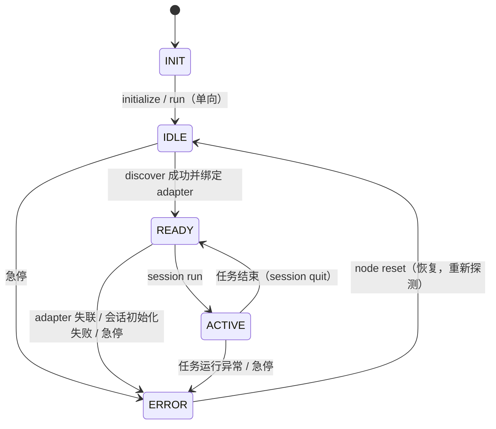

# 节点生命周期（node）

## 摘要

`EdgeNode`（`src/motrix_edge/node.py`）是**唯一节点入口 / 启动对象**：持续监听命令源并驱动
5 状态生命周期状态机（`NodeLifecycle` 校验转移合法性），同时驱动周期任务（IDLE 探测机器人 /
READY·ACTIVE 失联检查）。adapter 生命周期**归节点**；会话（session）由 `session run <type>`
启动后复用节点 adapter。

## 目标

-   统一控制入口：节点只响应命名命令，不绑定输入来源（CLI / HTTP / 脚本可替换）。
-   状态机校验对所有命令来源生效（互斥兜底）；`robot estop` 为全局安全命令。
-   无硬件可单测（注入 fake `command_source` / monkeypatch `discover_adapter`）。

## 生命周期状态机

5 状态，合法转移由 `NodeLifecycle` 校验（其余转移被忽略并告警）：

| 状态   | 描述                                                                              |
| ------ | --------------------------------------------------------------------------------- |
| INIT   | 初始化中（构造后默认）；`initialize()` / `run()` 完成后进入 IDLE，**不再回 INIT** |
| IDLE   | 无 adapter（探测中）：主循环周期 discover 探测，等待机器人进程上线                |
| READY  | 有 adapter 就绪：等待 `session run <type>` 选择任务                               |
| ACTIVE | 任务执行中：会话在后台线程运行；`session quit` 退出回 READY                       |
| ERROR  | 硬件故障 / 通信异常 / 失联：`node reset` 恢复回 IDLE                              |

## 主循环与周期任务

`EdgeNode.run()` 阻塞监听命令并驱动 `_tick()` 周期任务：

-   **IDLE**：周期 `discover_adapter(host, port)` 探测机器人进程，地址来自 `adapter.host` / `adapter.port`；失败**持续重试等待上线**，不报错。
-   **READY / ACTIVE**：周期 `adapter.health()` 检查心跳；进程失联 → ERROR。
-   **READY / ACTIVE**：节点级**持续观测**（`adapter.observe()` → `frame_manager`），观测
    **不依赖进入会话**——已绑定 adapter 即可预览 / 推流；**显示观测统一归节点**，会话不再
    写 frame_manager（采集会话不 observe；推理会话 observe 仅作推理输入）。
-   **ACTIVE + capture**：周期刷新采集数据状态缓存（`adapter.data_status()`），server 状态只读缓存，
    **不因前端轮询而实时请求 SDK**（edge 运行不依赖前端）。
-   **ACTIVE + capture**：周期刷新采集状态缓存（`adapter.capture_status()`，采集员 / 任务名等元信息 + 运行位），
    server 状态只读缓存，**不因前端轮询而实时请求 SDK**。

## 命令分发

命令由 `command_source`（默认 CLI 行输入 / 可注入 `CommandBus`）返回，`_dispatch` 按当前状态
分发到处理器；未处理命令统一回执「not applicable」避免 submit 挂起。关键规则：

-   `robot estop`：**全局安全命令**，任何非 ERROR 状态先安全停止再转 ERROR。
-   IDLE：拒绝 `session run` / `robot reset`（机器人未就绪）。
-   READY：`session run <type>`（选择 + 启动一步完成 → ACTIVE）、`robot reset`、`robot execute <qpos>`、`robot teleop <bool>`。
-   ACTIVE：`session quit`（退出 → READY）、`robot reset`、`robot execute`、`robot teleop`。
-   ERROR：仅 `node reset` 恢复 → IDLE。

## 任务线程模型

`session run <type>` 选择并启动会话后，会话 `run()` 在**后台线程**执行（任务运行期间主循环不再
poll 命令，会话内命令由会话循环消费）；`_tick` 检测线程结束并推进状态。退出命令（`session quit`）
回执在节点状态落定后**补发**（HTTP exit 同步等到 node READY）。节点失联 ERROR 时终止任务线程，
让主循环恢复 poll（ERROR 恢复命令可达）。

## adapter 生命周期（归节点）

-   **绑定**：IDLE 探测到可用 adapter → 实例化并绑定为 `node.adapter` → READY。
-   **复用**：会话注入该 adapter（`get_session(..., adapter=node.adapter)`），不自行实例化、不释放。
-   **释放**：ERROR 恢复（`node reset`）→ 释放 adapter 回 IDLE 重新探测。

## 相关文档

-   状态转移细节 / 命令定义：[命令总线（CommandBus）](./motrix_edge_command_bus.md)
-   adapter 发现与绑定：[机器人适配器（adapter）](./motrix_edge_adapter.md)
-   会话实现：[会话（session）](./motrix_edge_session.md)
-   代码入口：`src/motrix_edge/node.py` —— 随 **feat/6**（任务运行时核心）落地
