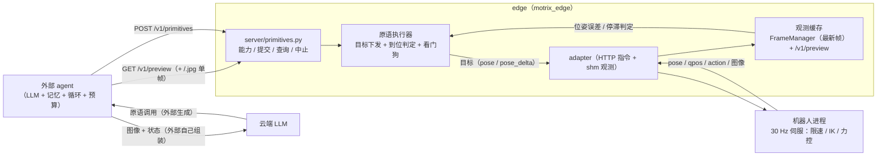

# 边缘原语接口（primitives）——面向外部 agent 的执行层

> **状态**：**设计定稿，代码未实现**——本仓库当前没有 `server/primitives.py`、`/v1/primitives`
> 或单帧取图端点，本文通篇是**目标态**（分期见文末「分期」，未决项见文末「未决项」）。
> 它依赖的位姿 / 动作空间契约（`observations/pose` / `observations/pose_target` /
> `observations/gripper`、`ActionSpace.POSE` / `ActionSpace.POSE_DELTA`、`/v1/preview` 的
> `pose` / `pose_target` / `gripper` / `arms`）来自**位姿动作 MR**，master 上同样尚未提供。

## 摘要

**edge 不内建 agent。** LLM 调用、对话/规划循环、记忆（历史观测缓存）、预算与决策日志都在
**外部**（自研 agent 服务、CaP 运行时、训练脚本）——这些是应用层职责，放进 edge 会让边缘
服务长出一个难以测试、职责不清的智能体循环。

edge 只提供两件**确定性、可安全校验**的事：

1. **观测查询（pull）**：当前状态（末端位姿 / 夹爪 / qpos / action）+ 相机帧；
2. **原语执行（write）**：`goto` / `move_rel` / `rotate_rel` / `gripper` / `recover` / `wait` / `stop`，
   **含到位判定**（观测位姿对**机器人侧目标位姿**的误差）、超时 / 受阻终态、可中止。

外部 agent 的典型一拍：`GET /v1/primitives`（能力）→ 需要就看图 → `POST /v1/primitives`
（同步等到位）→ 读终态 → 再规划。**记忆与循环全在外部**：它想「回看某个 pose 时的画面」，
就自己定期拉帧存在自己的历史里（edge 不存历史、不做检索）。

RPent（Recursive Physical Agent）是一种具体的外部 agent：它的 `env.*` 方法如何落到本文的
原语与观测上、以及对外命名如何统一为 `<scope>/<verb>`，见
[RPent 对接契约](./motrix_edge_rpent_bridge.md)（该文也写明了边界：**VLA 由 RPent 侧自跑，
edge 不提供 `vla.*` 接口**）；本文只定义原语语义。

## 与既有两条路径的边界

| 路径                               | 谁在闭环                             | 动作形态              | 是否经过 RTC                 |
| ---------------------------------- | ------------------------------------ | --------------------- | ---------------------------- |
| 采集（capture session）            | 人类 / 遥操作                        | 关节目标              | —                            |
| VLA 推理（infer session + policy） | edge（按块 push 观测，`infer_freq`） | 连续动作块 `[H, dim]` | **是**（预取 / 切分 / 过渡） |
| **原语（本文，node 级）**          | **外部 agent**                       | 单个目标 + 完成条件   | **否**（无块概念）           |

-   **LLM 轨迹策略不进本仓库**：LLM 是调用方，不适合被 infer 按块调用（edge 不提供
    `policy/llm` 一类的轨迹策略）；
-   **不做 agent session**：原语挂在 node 级（像 `/v1/preview` 一样），只须持 Edge 租约——
    edge 不提供内建循环 / 记忆 / SSE 对话流，也不需要新会话类型；
-   依赖的既有契约（**随位姿动作 MR 引入，尚未在 master**）：观测键 `observations/pose`（实测位姿）、
    `observations/pose_target`（= `FK(关节段目标)`，`target` 与到位判定必需）、
    `observations/gripper`（夹爪实测）；动作空间 `ActionSpace.POSE`（= `"pose"`，绝对目标）与
    `ActionSpace.POSE_DELTA`（= `"pose_delta"`，增量原语）；`/v1/preview` 的 `pose` /
    `pose_target` / `gripper` / `arms`。（基座用的关节段目标是 **`action`** 键，master 已有。）

## 拓扑



## 接口（新 `server/primitives.py` + 观测补充）

| 方法 | 路径                        | 说明                                                                                                                                                                                                |
| ---- | --------------------------- | --------------------------------------------------------------------------------------------------------------------------------------------------------------------------------------------------- |
| GET  | `/v1/primitives`            | **能力清单**：可用原语 + 参数 schema + 钳制范围（工作空间盒 / 单步上限 / 夹爪值域）+ 机器人是否提供位姿（`pose_dim`）                                                                               |
| POST | `/v1/primitives`            | **提交原语**：`{op, args, tol_pos?, tol_rot?, timeout?, wait?}` → `{primitive_id, state, error_m?, error_rad?, elapsed?}`；`wait=true`（缺省）**阻塞到终态**，`wait=false` 立即回执                 |
| GET  | `/v1/primitives/{id}`       | 查询终态 / 进度（`state` / `error_m` / `error_rad` / `elapsed` / `reason`）                                                                                                                         |
| POST | `/v1/primitives/{id}/abort` | 中止该原语（清目标、保持当前位姿），终态 `aborted`                                                                                                                                                  |
| GET  | `/v1/preview`               | 当前观测（master 已有 `qpos` / `action` / 相机图像名 `images`；`pose` / `pose_target` / `gripper` / `arms` 随位姿动作 MR 提供，与 [Edge Web Console](./motrix_edge_web_console.md) 状态行同一分类） |
| GET  | `/v1/preview/<cam>.jpg`     | **单帧 JPEG**（外部 agent 取图喂 LLM 用；图像不进 JSON）；端点**形态待定**，见「未决项」4                                                                                                           |

-   **受控操作**：全部须持 Edge 租约（与 `/v1/commands` / `/v1/preview` 同规则）；
-   **同步优先**：外部生成的代码（`robot.goto(...)` 这类）天然是阻塞语义 → `wait=true` 是缺省，
    edge 在服务线程里等终态（不阻塞 uvicorn 事件循环：执行在 node 线程，HTTP 只轮询状态）；
-   **不做**：事件流 / SSE / 对话接口 / 历史检索 / 预算记账 / 人工确认（这些归外部；edge 只记请求日志）。

## 原语定义（单点声明，供 `GET /v1/primitives` 与校验器共用）

| op           | args（缺省）                                                                               | 语义                                                                                                                                                                                              | 钳制                                      |
| ------------ | ------------------------------------------------------------------------------------------ | ------------------------------------------------------------------------------------------------------------------------------------------------------------------------------------------------- | ----------------------------------------- |
| `goto`       | `pos`[3]（绝对，米）、`rpy?`[3]、`arm?`、`tol_pos?` / `tol_rot?`（缺省见下）、`timeout?`=5 | 笛卡尔点到点：`adapter.rollout(target, action_space=pose)`，机器人侧 IK                                                                                                                           | 目标须在工作空间盒内；`rpy` 需机器人支持  |
| `move_rel`   | `delta`[3]（米）、`arm?`、`tol_pos?` / `tol_rot?`、`timeout?`                              | 相对位移（等价「往前伸一点」）：edge 只下发 `pose_delta` 位移增量，**基准由机器人侧取**（不在上位算绝对目标，理由见 [RPent 对接契约](./motrix_edge_rpent_bridge.md)「增量原语的基准与到位判定」） | 单次位移 ≤ `max_step`（缺省 0.05 m）      |
| `rotate_rel` | `delta_rpy`[3]（弧度）、`arm?`、`tol_pos?` / `tol_rot?`、`timeout?`                        | 相对姿态：同 `move_rel`——只下发 `pose_delta` 的姿态分量增量，**基准由机器人侧取**                                                                                                                 | 单次姿态增量 ≤ `max_rot`（缺省 0.35 rad） |
| `gripper`    | `value` 0..1、`arm?`                                                                       | 夹爪开合（只改夹爪位，其余维**保持该臂关节段目标**——基座取 `action`（关节段目标）而非实测 qpos，理由同增量原语）                                                                                  | 值域 `[0, 1]`                             |
| `recover`    | `arm?`、`tol_pos?` / `tol_rot?`、`timeout?`                                                | 关节复位到该臂 home（`HOME["joint"]` 常量，不读实测关节角），**保持夹爪开合**（基座与 `gripper` 同规则：优先取 `action`（关节段目标）的夹爪维，实测兜底；不丢已夹持物）                           | —                                         |
| `wait`       | `seconds`                                                                                  | 保持当前目标等待（不新下发）                                                                                                                                                                      | ≤ `max_wait`（缺省 10 s）                 |
| `stop`       | —                                                                                          | 清目标、保持当前位姿（软停）。与 `abort` 的区别：`stop` 自身就是一个原语（外部主动「停在这里」），`abort` 针对**另一个**已提交的 `primitive_id` 中止（终态 `aborted`）                            | —                                         |

-   参数非法 / 越界 → **400 拒绝**（不静默截断：截断会让外部 agent 的"心理模型"与实际执行脱节）；
-   原语集**按能力协商**：机器人没有夹爪 → 清单里没有 `gripper`；无力控 → 不出现 `press`
    （力控原语留待 Phase C）；
-   下发通道**复用 `/v1/rollout`**：**绝对**目标（`goto`）用 `action_space=pose`、**增量**原语
    （`move_rel` / `rotate_rel`）用 `action_space=pose_delta`（edge → adapter → robot-pipeline），
    **robot 侧零新增端点**（两个动作空间随位姿动作 MR 引入）。
-   增量原语的**基准与到位参考都在机器人侧**：edge 不下发绝对目标，也不缓存基准位姿。
-   **容差分位置 / 姿态两项，且与 facade 同一份取值**：`tol_pos`（米）与 `tol_rot`（弧度）分别比、
    **都**满足才算 `arrived`——与 facade 对 `ActionSpace.POSE` 的 `settle.within()` 同一口径；
    **位姿原语一律如此，含只下发姿态的 `rotate_rel`**。缺省与 facade **同源**：位置 5 cm / 姿态
    0.4 rad（≈23°，有意放大以盖住 MIT 静态误差；标定与收紧见
    [RPent 对接契约](./motrix_edge_rpent_bridge.md)「MIT 力矩控制的容差标定」）。两边取值若不同源，
    同一个动作会出现「`/v1/primitives` 报 `timeout`、`/call` 报 `reached`」的打架。
-   容差**不得小于稳态误差量级**：MIT 力矩控制下无重力前馈、控制器只有 P/D → 关节停在
    `τ_gravity / kp` 附近；容差太小则 `arrived` 永远判不出来，每个原语都走满 `stall_s` / `timeout`。
-   `timeout` 是 edge 判终态的**执行超时**（与客户端 HTTP 等待无关）：缺省只覆盖短距微调，
    长行程 / 慢原语须显式加时（同 facade `settle` 的加时约定）。

## 到位判定与终态（edge 侧，观测驱动）

执行器在原语运行期间持续读 `FrameManager` 最新帧（与 `/v1/preview` 同源），判定：

| state     | 条件                                                                                                                       |
| --------- | -------------------------------------------------------------------------------------------------------------------------- |
| `running` | 已下发目标，尚未满足任一终态                                                                                               |
| `arrived` | 位置误差 < `tol_pos` **且**姿态误差 < `tol_rot`（分项比；多臂按 `arm` 取该臂位姿段；误差对 `target` = **机器人侧目标**）   |
| `blocked` | 位置误差 > `tol_pos` 或姿态误差 > `tol_rot`，且 `stall_s`（缺省 1.0 s，可配）内位姿变化 < `stall_eps`（撞到东西 / 力不足） |
| `timeout` | 超过 `timeout`                                                                                                             |
| `aborted` | 外部调 abort，或 `robot estop` / 遥操作开启                                                                                |
| `failed`  | 下发失败（adapter 拒绝 / 无位姿观测且无兜底）                                                                              |

回执带 `error_m` / `error_rad`（终态时的**位置 / 姿态误差，分项报**——与 facade 的
`final_err_m` / `final_err_rad` 同口径，agent 据此看出「差在哪一项」）、`elapsed`、`reason`（人读说明）。

`target` 指**本原语下发目标在机器人侧的落点**：`goto` 是 edge 指定的绝对位姿；
`move_rel` / `rotate_rel` 是机器人按增量叠加出的目标位姿（读 `observations/pose_target`）。
edge **不自己算绝对目标**——理由（稳态误差逐条累积、读-算-写竞态窗口）见
[RPent 对接契约](./motrix_edge_rpent_bridge.md)「增量原语的基准与到位判定」。

-   **机器人不提供位姿**（`pose_dim = 0`）：`arrived` 无法判定 → 降级为「`timeout` 即视为完成」
    并在能力清单里显式标注（外部 agent 可据此改用 `wait`）；
-   未来可选增强：robot 侧上报 `at_target` / `blocked`（力超限、堵转），判定更精确，**edge 接口不变**。

## 并发、互斥与人工优先

-   **单飞**：同一时刻至多一个 `running` 原语；已有在跑时再提交 → **409**（附当前 `primitive_id`），
    串行由外部负责（它的循环本来就是串行的）；
-   **会话互斥**：`capture` / `infer` 会话运行中 → 原语 **409**（避免两套东西同时写机器人 target）。
    ⚠️ 待确认：数采时是否允许外部 agent 干预（默认不允许；`teleop` 通道始终可用）；
-   **急停最高优先**：`robot estop` → 所有原语 `aborted`，复用现有 critical 命令旁路；
-   **遥操作 / 人工接管优先**：`teleop_enabled` 期间拒绝原语（与 `rollout()` 拒绝语义一致）。

## 安全

-   **白名单 + 参数钳制**：op 仅限清单内；`goto` 目标限工作空间盒；`move_rel` 限单步；
    `rotate_rel` 限单次姿态增量；`gripper` 限值域；`wait` 限时长（配置位置**待定**，
    见「未决项」3）；
-   **不 eval 任何模型输出**：外部 agent 生成的是"原语调用"，edge 只解析结构化参数；
-   **急停 / 失联 / 租约过期**：原语立即中止（清目标），终态可查；
-   **不做**：人工确认、预算、审计留档（外部职责）；edge 只在请求日志里记录
    `id / op / args / state / error_m / error_rad / elapsed`。

## 外部 agent 侧（不在本仓实现，仅固化契约）

-   **记忆**：外部自己定期 `GET /v1/preview`（或取帧端点）落盘/入缓存；「某 pose 对应的历史图」
    完全由外部检索——edge 不存历史；
-   **循环**：plan → 原语 → 观测 → 再 plan；edge 不参与触发；
-   **能力发现**：`GET /v1/primitives` 的清单可直接转成 LLM 的 tool schema（参数名 / 范围 / 单位都有）；
-   **典型伪代码**（外部）：

```python
for step in range(max_steps):
    state = api.preview()                      # pose / 夹爪 / qpos
    image = api.frame("cam_head")              # 需要时才取图（省 token）
    plan = llm.plan(task, state, image, tools=api.primitives())   # 外部生成原语调用
    for call in plan.calls:
        result = api.run(call.op, call.args)   # 同步等到位（wait=true）
        if result.state != "arrived":
            break                              # 受阻 / 超时 → 下一轮重新规划
```

## 分期

-   **Phase A**：`GET/POST /v1/primitives` + `GET /v1/primitives/{id}` + `abort`；原语执行器
    （`goto` / `move_rel` / `rotate_rel` / `gripper` / `recover` / `wait` / `stop`，即上表全部）+ 到位 / 停滞 / 超时判定 + 参数钳制；
    观测补 `GET /v1/preview/<cam>.jpg`；单飞与会话互斥（409）。
-   **Phase B**：`blocked` 的 robot 侧上报（`at_target/blocked`）、姿态容差的实机标定复核、
    可选轻量事件流（长任务的进度推送）、前端**原语状态面板**（只读：当前 op / 误差 / 终态 + 急停）。
-   **Phase C**：力控 / 接触原语（`press` / `grip_until`，依赖机器人能力）、`follow_trajectory`
    （把"轨迹"降为一个原语，供外部做最后几厘米对准）、外部 SDK（薄客户端，含重试与串行封装）。

## 未决项（待确认）

1. **提交语义**：`wait=true` 同步阻塞（推荐，外部代码最简单）+ `wait=false` 异步 —— 是否两者都要？
2. **与会话互斥**：`capture` / `infer` 会话运行中是否一律拒绝原语（推荐），还是数采时允许干预？
3. **钳制配置**：工作空间盒 / 单步上限 / `max_wait` 放在 `edge.yml` 的 `primitives` 段（推荐），
   还是沿用 adapter 运行时配置（`adapter config set`）？
4. **取图端点形态**：`GET /v1/preview/<cam>.jpg`（推荐，简单）还是带 `?at=seq` 的"最近帧"查询？
5. **`pose_dim = 0` 的机器人**：降级语义（超时视为完成）是否可接受，还是要求先补位姿观测？
