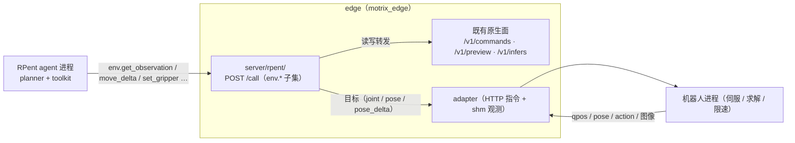

# RPent 对接契约（RPC facade 与命名约定）

> **状态**：**实现整体待合入**——本文描述的 `/call` facade（`server/rpent/` 包 + `server/routes/rpent.py`
> 路由）、`<scope>/<verb>` 命名、动作块布局转换与 `settle` 到位判定**只在开发分支**，
> master 上不存在（`server/rpent/`、`tests/test_rpent.py` 均无）；它依赖的位姿动作链（`pose` / `pose_delta` / `pose_target`、
> robot 侧 `kinematics`）同样待合入。因此文中的「已实现」一律指**本特性 MR 内的实现**。

## 摘要

RPent（Recursive Physical Agent）用 LLM 当「大脑」、冻结的 VLA 当「小脑」，通过多轮
工具调用把原语组合成长程操作。它把**环境**与**模型**都抽象成独立进程，两者都通过同一套
**方法级 RPC**（`<facade>.<verb>`）通讯，HTTP 走单端点 `POST /call`。

本文固化 edge 侧与该协议的对接契约：RPent 的 `env.*` 方法如何落到 edge 既有的
机器人动作、观测与原语路径上；并顺带统一 edge 自己的对外命名——**所有对外操作按
`<scope>/<verb>` 命名**（`robot` / `capture` / `infer` / `node` / `lease` / `adapter`），
即把 `/v1/commands` 的扁平 capability（`robot_execute` 一类）改为 `robot/execute` 形态。

primitives 的**语义**（到位判定 / 受阻 / 钳制）单点在
[边缘原语接口](./motrix_edge_primitives.md)；本文只定义**对接形态与命名**，不重复语义。

## 目标与成功标准

-   RPent 的 `dual_franka` 一类真实机器人可以**把 edge 当 env 后端**：`--env-endpoint
http://<edge>:8000` 后，agent 的 `move_delta` / `rotate_delta` / `set_gripper` /
    `recover_joint_posture` / `chunk_step` / `get_observation` 全部由 edge 承接；
-   同一套命名让 edge 对外面的**自描述**成立：一个 scope 词表同时表达「CLI 命令词」
    「HTTP capability」「RPC 方法名」，不出现三套同义字符串；
-   安全边界不因接入 RPent 而放松：RPent 侧只发意图（相对位移 / 夹爪开合 / 关节复位），
    **白名单 + 参数钳制 + 租约 + 急停优先**仍由 edge 强制（RPent 自己的约定也是
    「安全限制由 env_server 强制执行」，与 edge 一致）。

## RPent 侧协议（外部事实，单点记录）

来源：`RPent/rpent/utils/rpc/{http_rpc,rpc_facade,rpc_client}.py`、
`RPent/rpent/robots/components/env_facade_base.py`；接入指南见其
`docs/source-zh/rst_source/development/{interfaces,add_robot,add_primitive}.rst`。

| 项        | 约定                                                                                                                                  |
| --------- | ------------------------------------------------------------------------------------------------------------------------------------- |
| 端点      | **单一** `POST /call`（没有 REST 资源路径）                                                                                           |
| 请求体    | `{"method": str, "args": [..], "kwargs": {..}, "session_id": str \| null}`                                                            |
| 响应体    | **HTTP 始终 200**：`{"ok": true, "result": ...}` 或 `{"ok": false, "error": str, "traceback": str}`                                   |
| 数组编码  | ndarray → `{"__ndarray__": base64(tobytes), "dtype": "float32", "shape": [..]}`；NumPy 标量 → `{"__npscalar__": value, "dtype": ...}` |
| 方法命名  | `<facade>.<verb>`；已用命名空间 `env` / `vla` / `molmo` / `sam3` / `session`，框架方法 `healthz` / `shutdown`                         |
| 并发      | facade 侧 `_readonly_methods` 走共享读锁、写方法独占写锁；`session.*` 是**可选**（`enable_sessions`，默认关）                         |
| 错误      | facade 抛异常 → `ok=false` 信封；未知方法 → `unknown RPC method: 'x'`                                                                 |
| meta 校验 | client 侧可选严格比对 `env.get_env_meta`（`BaseEnvClient` 断言相等；`dual_franka` 只要求 `explicit_reset_only=True`）                 |

`env.*` 方法集（`env_facade_base` 基础 + franka 系扩展）：

| 方法                                          | 语义                                     |
| --------------------------------------------- | ---------------------------------------- |
| `env.get_env_meta`                            | 启动自描述（能力 / 维度 / 相机）         |
| `env.get_observation` / `env.get_robot_state` | 当前观测（含 `states`）/ 机器人状态      |
| `env.get_camera_meta`                         | 相机名与规格                             |
| `env.reset`                                   | 复位（dual-Franka 要求**显式复位**语义） |
| `env.move_delta` / `env.rotate_delta`         | 相对位移 / 相对姿态（笛卡尔增量）        |
| `env.set_gripper`                             | 夹爪开合（`open: bool`）                 |
| `env.recover_joint_posture`                   | 关节复位（可保持已夹持物体）             |
| `env.chunk_step` / `env.step`                 | 执行动作块 / 单步                        |
| `env.get_task_language` / `env.render_camera` | 任务语言描述 / 取相机帧                  |

模型侧另有一套 `vla.predict(obs, options) -> actions`（`BaseVLAFacade` 注册、`BaseVLAClient`
调用），语义 = 「给定观测出一段动作块」——**不属于本文的对接范围**（见下节）。

## 拓扑（实现随本特性 MR 合入）



-   RPent 用 `--env-endpoint http://<edge>:8000` 指过来（`HttpRpcClient` 只 `POST /call`）；
-   `/call` 是**同一批 edge 能力的另一种传输形态**，不新增硬件契约：读写都经 node /
    `CommandService` / adapter，与原生面共享同一份真相（不出现第二套状态）；
-   **免租约白名单**（`healthz` / `env.get_env_meta` / `env.get_camera_meta`）让 agent 在签发
    租约前完成握手与能力协商；其余方法与原生面同规则，须持活跃租约（租约 id 由服务自行解析：
    `server.rpent.lease_id` 固定 → 否则取当前活跃租约）；
-   RPent 侧需新增/复用一个机器人包（`robots/<robot>/`）把 `env.*` 指向 edge：`env_client.py`
    薄适配 + `toolkit.py` 工具集 + `prompt_bundle.py` + `robot_spec.py` 的 `--env-endpoint`。

## 方法映射（实现随本特性 MR 合入）

| RPent 方法                            | edge 承接                                                                                         | 备注                                                                                                           |
| ------------------------------------- | ------------------------------------------------------------------------------------------------- | -------------------------------------------------------------------------------------------------------------- |
| `healthz`                             | 存活探针（免租约）                                                                                | RPent 连接前轮询                                                                                               |
| `session.register` / `session.close`  | 确认收到（no-op）                                                                                 | 隔离载体是 Edge 级租约                                                                                         |
| `env.get_env_meta`                    | adapter 能力自描述（免租约）                                                                      | 含 `explicit_reset_only` / `inline_cameras`                                                                    |
| `env.get_camera_meta`                 | 相机清单 + 观测缓存尺寸（免租约）                                                                 | 帧按相机名直出，无别名映射                                                                                     |
| `env.get_observation`                 | `node.frame_manager` 观测帧（JPEG → uint8 RGB ndarray）                                           | 带 `states`（同帧 qpos）                                                                                       |
| `env.get_robot_state`                 | qpos / pose / 每臂夹爪 + `wrapped_state_vector`                                                   | —                                                                                                              |
| `env.reset`                           | 命令通道 `robot/reset`（含租约与回执）                                                            | 不隐式复位                                                                                                     |
| `env.move_delta` / `env.rotate_delta` | `adapter.rollout(..., action_space=pose_delta)`                                                   | 增量交给机器人叠加在**关节段目标**上                                                                           |
| `env.set_gripper`                     | `adapter.rollout(..., action_space=joint)`                                                        | 关节段取**目标**（`action`），只改夹爪位                                                                       |
| `env.recover_joint_posture`           | `adapter.rollout(..., action_space=joint)`：每臂 `HOME["joint"]` + 保持夹爪                       | **已对齐**（无 `HOME["joint"]` 声明才退回 `adapter.reset()` 并标 `fallback`，见「与 RPent 客户端的形态对齐」） |
| `env.step`                            | 单帧 `adapter.rollout(...)` → gym 5 元组                                                          | 遥操作中拒拍 → `ok=false`                                                                                      |
| `env.chunk_step`                      | 逐帧 `adapter.rollout(...)`（频率由 `server.rpent.step_hz` 定，null = 机器人上报的 `control_hz`） | 回 `observation` / `terminated` / `truncated`                                                                  |
| `env.get_task_language`               | 推理会话的 `prompt`                                                                               | 无会话 → `null`                                                                                                |
| `vla.predict`                         | **不由 edge 提供**（决策）                                                                        | VLA 由 RPent 侧自跑（见「与 VLA 的边界」）                                                                     |
| `shutdown`                            | **不注册**                                                                                        | edge 生命周期归 node / Console                                                                                 |

### 与 VLA / 策略的边界

**VLA 归 RPent 侧自跑，edge 不提供 `vla.*` 接口**：RPent 的模型侧（`vla_server` +
`BaseVLAClient`）自己加载权重、自己出动作块，再把块交给 edge 执行：

```text
RPent vla_server（vla.predict）→ RPent primitives → env.chunk_step → edge → adapter → 机器人
```

-   edge **不提供** `vla.predict`：不把 edge 的推理会话 / RTC / 策略客户端暴露成 RPC 方法；
-   edge 的 `infer` 会话（push 观测按块取动作、RTC 时序平滑、预热）只服务 **edge 自己的**
    策略路径（openpi / lerobot-act），与 RPent 的 VLA 无关，两者不共享会话；
-   RPent 的 VLA 动作块落到 edge 的入口是 `env.chunk_step` / `env.step`（动作布局必须与
    `action_dim` 一致，否则 `ok=false`）。

### `states` 与观测键

RPent 的 `dual_franka` client 要求 `env.get_observation` 返回里带 `states`（agent 侧
缓存为 `wrapped_state_vector`）。edge 的对应物是**同一帧的 qpos**（`observations/qpos`，
`FrameManager.latest()` 已有）：facade 把该帧 qpos 同时按 `states` 回一份，维持 RPent
原样可用；`pose` 单独作为扩展键回传（RPent 侧不读、不影响其契约）。

### 动作语义与单位的边界

edge 的契约是 `action_space ∈ {joint, pose, pose_delta}` + `action_dim`（每臂一段；位姿每臂
`xyz + rpy + 夹爪` = 7）。两条路径：

-   **原语路径**：`move_delta` / `rotate_delta` 只需 **xyz / rpy 标量** → edge 只下发 `pose_delta`
    增量（**基准归机器人**，见下「增量原语的基准与到位判定」）；`set_gripper` 走 `joint`（关节段
    取目标、只改夹爪位）。三者都不依赖动作布局，无歧义；
-   **`step` / `chunk_step` 路径**：默认要求块的布局与 `action_dim` 一致（不一致 → `ok=false`，
    **不静默 reshape**）；若对方是自有布局，用下面的 `action_layout` 声明。

其余约定：**夹爪** edge `[0, 1]`（每臂动作段最后一位）；**末端位姿**每臂 `xyz + rpy`（米 /
弧度，`pose_convention: "xyz_rpy"`）；两者都在 `env.get_env_meta` 里声明。

### 外部动作块布局转换（`action_layout`）

对方（如 RPent 的 dual-Franka）的动作块是**它自己机器人包的布局**——20 维
`[L_xyz(3), L_rot6d(6), L_grip(1), R_xyz(3), R_rot6d(6), R_grip(1)]`，且是**绝对 TCP 位姿**
（其配置里的 `action_scale = [0.02, 0.1, 1.0]` 是机器人侧的每步限幅，不是归一化系数）。

配 `server.rpent.action_layout: rpent/dual_franka` 后，`env.step` / `env.chunk_step` 会**逐帧**
把块转成 edge 的每臂 `[xyz, rpy, gripper]` 绝对目标再下发（求解仍归机器人侧）：

| 转换   | 规则                                                                                                                                                                         |
| ------ | ---------------------------------------------------------------------------------------------------------------------------------------------------------------------------- |
| 姿态   | `rot6d`（旋转矩阵前两列、列主序）→ 旋转矩阵（第三列 = 前两列叉乘，先 Gram-Schmidt 正交化）→ `rpy`（约定 `R = Rz(yaw) @ Ry(pitch) @ Rx(roll)`）                               |
| 夹爪   | 对方 `+1 = 张开 / -1 = 闭合` → edge `[0, 1]`（`(g + 1) / 2`，先限幅）                                                                                                        |
| 臂映射 | 按**臂名**对齐到 edge 启用臂；布局里有而 edge 未启用的臂忽略；edge 启用而布局未覆盖的臂**保持当前目标位姿**（优先 `observations/pose_target`，退化实测 `observations/pose`） |
| 缩放   | **不做**（绝对位姿语义）；维度不符 / 臂名不相交 / 未知布局名 → `ok=false`                                                                                                    |

-   **只做数值映射**、不缩放、不猜语义：布局名是唯一开关，不自动识别「增量 vs 绝对」；
-   `server.rpent.dry_run: true` → **任何下发都被拦住**：`step` / `chunk_step` 只回转换结果；
    `reset` 与四条写原语回 `dry_run: true` + `sent: false` + `reached: null` + `reason: "dry_run"`
    （数值仍在 `target` / `action` / `converted` 里可核对）；`_push_action` 再兜一层底——真有路径
    漏了就直接报错，绝不默默把机器人动了。
    ⚠️ `dry_run` 必须覆盖**所有写路径**（含 `reset` 与四条写原语），否则会出现“回执说 dry-run、
    机器人却真的动了”——`tests/test_rpent.py` 钉住这条约束。
    节点是否处于 dry-run 可从 `env.get_env_meta` 的 `settle.dry_run` 看出（与生效容差 /
    `image_source` / `action_layout` 同在 `settle` 段；供 agent 启动告警）；
-   新增布局 = 在 `_RPENT_LAYOUTS` 登记臂顺序（每臂块固定 `xyz + rot6d + 夹爪`）。

### 与 RPent 客户端的形态对齐（结论）

以下几处 RPent 客户端 / 工具期望的形态与 edge 的原生返回不同，已按下表结论对齐（改 edge 或
RPent 侧适配二选一）。右列处置**随本特性 MR 合入**，不是 master 现状：

| 项                          | RPent 期望                                                  | edge 现状                              | 结论                                                                                                                                  |
| --------------------------- | ----------------------------------------------------------- | -------------------------------------- | ------------------------------------------------------------------------------------------------------------------------------------- |
| 末端位姿编码                | `tcp_pose = [x, y, z, qx, qy, qz, qw]`（过了 `from_quat`）  | 扁平 `pose` 仍是 `xyz + rpy`           | **已解决**：每臂块额外给 quat `tcp_pose`（两种约定共存）                                                                              |
| 机器人状态结构              | 每臂块 `left_arm` / `right_arm`（关节 / 夹爪 / `tcp_pose`） | 扁平 + 每臂块                          | **已解决**（`env.get_robot_state` 同时给两套）                                                                                        |
| 观测图分辨率                | 原图（如 640×480）                                          | 默认 `image_source: native` → **原图** | **已解决**（planner 面向给原图；`preview` 可回 320×240；VLA 逐帧观测恒走缓存）                                                        |
| `recover_joint_posture`     | 关节复位**保持已夹持物**                                    | 关节回 home + **保持夹爪**             | **已解决**（无 `HOME["joint"]` 声明才退回 `adapter.reset()` 并标注 fallback）                                                         |
| `env.get_env_meta` 严格比对 | `BaseEnvClient` 断言 meta **完全相等**                      | 我方 meta 是超集                       | **已澄清**：自写 client（其 franka 包覆写了 `__init__`，断言不执行）                                                                  |
| 内联相机来源                | `dump_state` 只读 `get_camera_meta` 的 `agent_observation`  | 两处共用同一 helper                    | **已解决**（缺这项模型只拿到路径、盲跑）                                                                                              |
| 原语到位判定                | 工具返回前就知道「到没到」                                  | `settle` 阻塞到到位 / 超时 / 停滞      | **已解决**（回执 `reached` / `final_err`（+ 分项 `final_err_m` / `final_err_rad`）/ `elapsed_s` / `stalled` / `timeout`，可逐次覆盖） |

## RPent 侧机器人包（`robots/motrix_edge/`）

**不复用 `robots/franka|dual_franka`**：那两个包把 dual-Franka 的 config / calibration /
tasks / prompt 写死在 `set_robot_config_path(DEFAULT_CONFIG)`、`--calibration-path`、D455 相机
别名与任务集里，背过来会污染我们的相机名、臂名与任务语义。新建一个自己的包，但**沿用 RPent 的
包结构与工具约定**（`add_robot.rst` / `add_primitive.rst` 那套）。

```text
robots/motrix_edge/
    __init__.py          # 只 re-export get_robot_spec / get_toolkit
    robot_spec.py        # RobotSpec：CLI 参数 / parse_config / init_runtime
    env_client.py        # 薄 env client（只依赖 numpy + rpent base）
    tools.py             # MotrixEdgePrimitives + TOOLS_SPEC + dump_state + view_env_state
    toolkit.py           # 继承 Toolkit：按 TOOLS_SPEC 注册 + 自动状态捕获
    prompt_bundle.py     # system / user prompt 工厂
    prompts/             # prompt 分节文本
    tasks.py             # 任务集（可先只放一个 smoke 任务）
```

### 按 RPent 约定复用/省略的部分

| RPent 约定                                                                                                      | 我们怎么做                                                                                                                                                              |
| --------------------------------------------------------------------------------------------------------------- | ----------------------------------------------------------------------------------------------------------------------------------------------------------------------- |
| `RobotsSpec.init_runtime` 起 subprocess / attach                                                                | **只走 attach**：`--env-endpoint http://<edge>:8000`，`init_runtime` 返回 `(None, {"env": MotrixEdgeEnvClient(...)})`，不 spawn 任何 daemon                             |
| `env_server.py`                                                                                                 | **不需要**：env server 由 edge 承担（`POST /call`），这正是本文的对接点                                                                                                 |
| `vla_server.py`                                                                                                 | **不需要**：VLA 由 RPent 侧自跑（见「与 VLA 的边界」）                                                                                                                  |
| `toolkit.py` 遍历 `TOOLS_SPEC` → `handler = state_handlers.get(name) or getattr(self._primitives, name)`        | 照搬：工具名 == primitives 方法名；`@readonly` 的工具跳过状态捕获                                                                                                       |
| `dump_state(primitives, state, command, result, elapsed_s)` → `env.get_observation` + `state.save("<cam>.png")` | 照搬：**这是唯一拉观测的地方**；相机名用我们的 `cam_head` / `cam_left_wrist` / `cam_right_wrist`（按名字直出，无需别名映射）                                            |
| `@readonly view_env_state(step=-1)`                                                                             | 照搬：**纯本地 artifact 读取器**（`state.get` + `state.load_bytes`），**不打 edge** —— 打 edge 会破坏 `step=-1` 语义、step/artifact 记录与 Dashboard 的 StepRecordEvent |
| `view_camera_meta` 读当步落盘的 `camera_meta.json`                                                              | 照搬：`dump_state` 把 `env.get_camera_meta()` 存成该 step 的 `camera_meta.json`，工具再从文件读 `agent_observation.inline_cameras`                                      |
| `RobotSpec(is_real_robot=…, supports_exploration=…, dashboard=…)`                                               | `is_real_robot=False`（`True` 会强制 TTY 并拒 `--dashboard` / `--interactive`，无 TTY 的无人值守 run 直接起不来）；`supports_exploration=False`；`dashboard=None`       |
| 观测图分辨率由 edge 决定（RPent 不缩放，原样落盘 + 内联前 4 路）                                                | edge 默认给**原图**（`server.rpent.image_source: native`）；降级开关在 RPent 侧（`--no-images`）                                                                        |
| `pyproject.toml` extra + lazy import                                                                            | 新增 `motrix-edge = [...]` extra：未装依赖时 `rpent --help` 与机器人发现仍可用                                                                                          |
| `prompt_bundle`：一份 prompt 服务所有 planner                                                                   | 照搬：工具在 prompt 里用**裸名**（`move_delta`）；只在某处提一次 Claude Code / Codex 显示成 `mcp__rpent__<name>`                                                        |
| `tasks.py` 任务集 + VLA 条件文本                                                                                | 我们自己写；先放一个 smoke 任务（见下）                                                                                                                                 |

### 工具集（建议与 edge 原语一一对应）

**分工铁律**：只有非 `@readonly` 工具返回后由 `Toolkit` 自动跑的 `dump_state` 会碰 edge 观测；
`view_env_state` / `view_camera_meta` 都是读当步落盘 artifact 的本地工具。

| 工具名                                 | 调用的 edge 方法                                     | 回执里必须读的字段                                                             |
| -------------------------------------- | ---------------------------------------------------- | ------------------------------------------------------------------------------ |
| `move_delta`                           | `env.move_delta`（`arm?` + `delta_xyz`）             | **`reached`** / `final_err` / `elapsed_s` / `stalled` / `timeout`              |
| `rotate_delta`                         | `env.rotate_delta`（`arm?` + `delta_rpy`）           | 同上                                                                           |
| `open_gripper` / `close_gripper`       | `env.set_gripper(arm?, open)`                        | `reached` / `final_err` / `stalled`（见下）                                    |
| `recover_joint_posture`                | `env.recover_joint_posture(reason)`                  | `reached` / `gripper_preserved`（true = 关节回 home + 保持夹爪开合）           |
| `reset_home`                           | `env.reset`                                          | `states`（机器人回 home，**夹爪也回 home**；不恢复桌面场景，被夹持物可能掉落） |
| `get_robot_state`（可选，`@readonly`） | `env.get_robot_state`                                | `pose`（rpy）/ `left_arm` / `right_arm`（含 quat `tcp_pose`）                  |
| `view_env_state` / `view_camera_meta`  | **不打 edge**（读本步落盘 PNG / `camera_meta.json`） | 本地 artifact                                                                  |

**不注册**：`request_scene_reset`（属探索模式 + 操作员介导的**场景**恢复，真机必须人工）、
`back_project` / `segment`（依赖 RPent 本地标定，我们没提供内参/外参）、`request_operator_verdict`（探索模式）。

**位姿能力是前置条件**（真机 dual piper 曾踩过）：适配器**没声明 `pose_delta` 空间**时
（也就没有 `observations/pose_target`）——`move_delta` / `rotate_delta` 会
`ok=false kind=unsupported`、`settle` 回 `reached: null`，故 agent 启动就该拦。机器人侧需实现：
`POSE = 12`（每臂 6 维 `xyz+rpy`、米/弧度）+ `get_observation_pose(qpos=None)`（与位姿解算
**同一套运动学**，位姿动作设计文档随位姿动作 MR 合入）+ `get_target_pose()`
（= `FK(关节段目标)`：增量基准与上位判到位的参考）+ `POSE_FRAME`（与位姿下发同系，piper 为
`flange`）。

**增量原语的基准与到位判定**（MIT 力矩控制下的硬要求）：

-   **基准归机器人**：edge 只下发 `pose_delta`（每臂 `xyz + rpy` 增量），**不在上位算绝对目标**。
    拿「实测位姿 + 增量」当绝对目标会把当前稳态误差（`τ_gravity / kp`）写进新目标，逐条累积且
    闭环永不收敛；同时上位「读基准 → 算 → 写」之间存在窗口（遥操作接管 / CLI 直控 / 别的会话改
    目标），窗口内目标一变就被旧基准覆盖。
-   **到位参考取目标位姿**：下发后先等 `observations/pose_target` 从下发前快照**跃迁**（确认命令
    已落地——下发走命令队列、观测按观察频率发布，不等就会拿旧目标当参考而误判到位），再以跃迁后的
    目标为参考判到位。命令一直未落地（超 `settle.target_wait_s`）→ `reached: null` +
    `not_applied`；跃迁后的目标与「快照 + 增量」不符 → `base_changed`（基准被第三方改动，回执
    如实标注而不是当成自己的结果）。
-   **同类规则**：关节空间「保持当前姿态」的基座同样取**目标**（`action`）而不是实测
    `observations/qpos`（`set_gripper` 即此规则）；`recover_joint_posture` 的手臂段取 `HOME["joint"]`
    常量、夹爪段保持**目标**开合（基座同 `set_gripper`：目标优先、实测兜底）；动作布局未覆盖的臂回填
    也取目标位姿。一句话：**“发到哪”看目标，“到了没”看实测**。

**原语写法的三个硬要求**（RPent 工具约定）：

1. 原语**返回前不要自己截图**：`Toolkit` 会在 handler 返回后自动 `dump_state`（那里才拉观测）；
2. 原语**必须检查 `reached`**：`reached is False` 时把 `stalled` / `timeout` 写进返回值，让 planner
   看到「受阻 / 超时」而不是「命令没生效」——这正是 edge 侧 `settle` 存在的理由。
   edge 回执同时给 `final_err`（+ 分项 `final_err_m` 位置米 / `final_err_rad` 姿态或关节弧度）、
   生效容差（`settle_pos_tol` / `settle_rot_tol`）与生效超时（`settle_timeout_s`）→ agent 能区分
   「还差一点，可补一小步」vs「`stalled`，禁止同向重发，必须重观测 / restage」；
3. 长行程 / 慢原语**逐次加时**：`settle={"timeout_s": 60}`（上限 90s，超了会被钳住 ——
   宁可 edge 提前回 `reached: false, timeout: true`，也不要变成客户端 HTTP 超时异常）。
   `settle=False` 只用于明确的**流式场景**（`chunk_step` 路径），工具 description 里必须写清「不保证到达」。
   `chunk_step` 本身不参与 settle。

**相机名的 artifact 约束**（RPent 的 `EnvState._validate_name`）：`raw_camera_frames` 的 key 会被
直接当成 PNG 基名，故相机名不能含 `.` 或 `/`；`agent_observation.inline_cameras` 必须与落盘基名完全
一致（不能带 `.png` 或路径），否则 `dump_state` 找不到图。

**MIT 力矩控制的容差标定**（真机必读）：底层 `set_joint` 只给 MIT 的 `p_des`，`kp` / `kd` / `t_ff`
全用缺省值（`t_ff = 0` 即**无重力前馈**），控制器又只有 P/D → **存在稳态误差**，「设定什么关节就是
什么关节」并不成立。故 `settle` 的容差必须按现场实测标定，否则 `reached` 永远不成立、每个写原语都会
走满 `stall_s` / `timeout_s`（agent 侧看到「全是 stalled / timeout」）：

-   **标定**：下发一个目标、等它停稳，看回执 `final_err_m` / `final_err_rad`（或 `final_err`）的平台值
    ——这与机器人型号 / 当前姿态 / 负载有关，不要照抄别人的数值；
-   **当前缺省值**（位置 5 cm / 姿态 0.4 rad ≈ 23°）是**有意放大**的：先把 MIT 静态误差盖住，
    让 `reached` 判得出来（否则每个写原语都走满 `stall_s` / `timeout_s`），等补上重力 / 力矩
    前馈或按实测收敛后再一起收紧；
-   **位置与姿态分别比容差**（`pos_tol` 比米、`rot_tol` 比弧度），不把两种量纲混进一个阈值；
-   `stalled` 也**可能是「已到稳态误差平台」而不是受阻**——两者从位置观测上不可区分，planner 应结合
    `final_err` 判断（接近容差 → 可补一小步；远大于容差且不再变化 → 受阻 / 需 restage）；
-   若现场看到「一直等到 `timeout` 也判不出 `stalled`」，是误差噪声让 `stall_eps` 失效
    （噪声量级 > 1e-4）→ 把 `settle.stall_eps` 调到噪声量级以上。

**夹爪的 `stalled` 是「接触/夹住」不是失败**：`close_gripper` 撞到物体时关节到不了目标值 →
edge 回 `reached: false` + `stalled: true`（~1s 内）——这正是抓取成功的证据，`dump_state` 随后
落盘的图会看到夹住。故夹爪工具应把 `stalled` 当「已接触」，不要与 `move_delta` 的受阻同等对待；
若想要「不阻塞、只看观测」，逐次传 `settle=False`（回 `reached: null`）或放宽 `rot_tol`。

### 实际取值（edge 认到的机器）

| 项       | 值（可由 `env.get_env_meta` 自描述，**不要在包里写死**）                                                                                                                 |
| -------- | ------------------------------------------------------------------------------------------------------------------------------------------------------------------------ |
| 相机     | `cam_head` / `cam_left_wrist` / `cam_right_wrist`（各 640×480 **原图**；WebRTC 预览缓存另为 320×240）                                                                    |
| 臂       | `left` / `right`（物理顺序；RPent 眼里每臂 7 = 值 6 + 夹爪 1，由桥接层拼 / 拆）                                                                                          |
| 动作空间 | `joint`（每臂 6 关节角，缺省）/ `pose`（每臂 `xyz + rpy`，绝对）/ `pose_delta`（每臂 `xyz + rpy` 增量，**基准归机器人**）/ `gripper`（每臂 1）——RPent 每臂 7 = 值 + 夹爪 |
| 夹爪     | `[0, 1]`（0 = 闭合，1 = 张开）                                                                                                                                           |
| 末端位姿 | `observations/pose` = 每臂 `xyz + rpy`（米 / 弧度）+ `pose_frame`（如 `flange`）；每臂块另给 quat `tcp_pose`                                                             |
| 任务语言 | `env.get_task_language` 读推理会话 prompt；真机任务文本建议由 `tasks.py` 自己给（RPent 侧未调用它）                                                                      |

### 启动顺序（P1-3）

```text
1) Console/前端签发 Edge 租约（或 pin server.rpent.lease_id）
2) 起 edge（motrix-edge run）→ 确认 GET /v1/rpent 的 lease.satisfied = true（端点字段见「安全、并发与租约」）
3) 起 RPent 侧（--robot motrix_edge --env-endpoint http://<edge>:8000）
```

-   RPent 的 eval client 连接时会立刻 `env.reset`（走命令通道、**要租约**）→ 没有活跃租约时
    启动即 `ok=false kind=lease`；`env.get_env_meta` 的 `lease` 段（`lease_id` / `source` /
    `satisfied` / `required` / `state` / `expires_at` / `expires_in_s` / `reason`）让 agent
    在连之前就能自检。**`satisfied` 的语义是「租约现在可用」（能过 `require`）**，不只是
    “解析出了 id”：pinned `lease_id` 但租约未安装 / 未生效 / 已过期 → `satisfied: false` +
    `reason`（否则启动自检会放行、第一次调用才爆 `kind=lease`）；
-   租约 TTL 必须覆盖整轮 run（真机 LLM 循环常见 10–40 分钟）→ Console 按 `renew_interval` 续租
    （默认 TTL 120s / 续租间隔 60s），或 pin 一个长 TTL 租约；租约中途到期 → 下一个写方法/观测
    调用变 `kind=lease`，agent 应把 `expires_in_s` 纳入启动检查；
-   `healthz` / `env.get_env_meta` / `env.get_camera_meta` 免租约，故**握手与能力协商**永远能跑。

### Smoke 任务（先跑这一条，再谈长程任务）

`healthz` → `env.get_env_meta`（核对相机/臂/action_dim）→ `env.get_camera_meta`（核对
`agent_observation.inline_cameras`）→ `env.reset` → `env.get_robot_state` →
小幅 `move_delta`（±1–2 cm，看 `reached` 与 `final_err`）→ `view_env_state`（确认 PNG artifact
与内联图都对）→ `set_gripper` → `recover_joint_posture`（确认夹爪保持）。

## 命名约定（`<scope>/<verb>`）

同一套 scope/verb 词表以三种写法出现在三处，**只在语义源头定义一次**（`command/naming.py`
的 `CMD_*` 常量）：空格 = CLI 文本（`robot execute`），斜杠 = HTTP capability
（`robot/execute`），点号 = RPC 方法（`robot.execute`）。

| scope     | 资源               | 例                                                                                  |
| --------- | ------------------ | ----------------------------------------------------------------------------------- |
| `robot`   | 机器人动作与状态   | `robot/execute` · `robot/reset` · `robot/teleop` · `robot/takeover` · `robot/estop` |
| `capture` | 采集会话与元信息   | `capture/episode/start` · `capture/sync` · `capture/meta/list`                      |
| `infer`   | 推理会话与策略配置 | `infer/connect` · `infer/rollout` · `infer/config/set`                              |
| `node`    | 节点生命周期       | `node/reset`                                                                        |
| `lease`   | Edge 级租约        | `lease/revoke`                                                                      |
| `adapter` | 适配器运行时配置   | `adapter/config/set` · `adapter/config/current`                                     |

`/v1/commands` 的 capability 迁移（`server/command.py`）：

| 现 capability           | 新 capability           | 形态         |
| ----------------------- | ----------------------- | ------------ |
| `estop`                 | `robot/estop`           | push（旁路） |
| `reset`                 | `node/reset`            | push         |
| `robot_reset`           | `robot/reset`           | submit       |
| `robot_execute`         | `robot/execute`         | submit       |
| `robot_teleop`          | `robot/teleop`          | submit       |
| `capture_episode_start` | `capture/episode/start` | submit       |
| `capture_episode_end`   | `capture/episode/end`   | submit       |
| `capture_sync`          | `capture/sync`          | submit       |
| `infer_connect`         | `infer/connect`         | submit       |

-   **派生而非手写**：capability 直接由 `CMD_*` 常量（空格 → `/`）派生，避免两张表漂移；
    旧拼写作为**别名**保留一个版本周期（回执里带 `deprecated` 提示），随后删除。
-   **命名边界**：edge→robot 进程的契约（`adapter/http_contract.py` 的 `/v1/execute` /
    `/v1/rollout` / `/v1/capture/*`）是**另一条边界**（不同 host:port，机器人进程自持），
    本次**不改名**，避免牵动在跑的真机进程与 robot-pipeline；只在文档里点明两者区别。

## 安全、并发与租约

-   **参数钳制**：facade 不做「转发器」——`move_delta` 的位移量、`set_gripper` 的值域、
    工作空间盒全部走 primitives 的校验器（越界 **400 / `ok=false`**，不静默截断）；
-   **单飞**：同一时刻至多一个写操作（primitives 已有的 409 语义在 RPC 面转成 `ok=false`）；
-   **急停最高优先**：`robot/estop` 仍走 critical 旁路；facade 的在飞操作转 `aborted`；
-   **遥操作优先**：`teleop` 开启期间拒绝原语（与 `rollout()` 拒绝语义一致）；
-   **租约**：`/call` 面**不带 `X-Lease-Id`**（RPent 不认该头）→ 由服务自行解析
    （`server.rpent.lease_id` 固定 → 否则取当前活跃租约，见文末「已决」）；无论如何
    **estop 与 node reset 不受租约影响**（与现有语义一致）；
-   **诊断端点 `GET /v1/rpent`**（**免租约**，供启动自检与排障）：
    `{enabled, endpoint: "/call", methods, lease}`——`methods` = facade **已实现的方法名**
    （能力自省）；`lease` = `RpentService.lease_status()`，与 `env.get_env_meta` 的 `lease`
    段是**同一个** dict（`lease_id` / `source`（`pinned` | `active` | `null`）/ `satisfied`
    （= 现在就能过 `require`，不是“解析出了 id”）/ `required` / `state` / `expires_at` /
    `expires_in_s` / `reason`）。未注入 facade 时回 **HTTP 501**
    （`ServiceError(code=not_implemented)` 经统一错误处理器映射，与原生面口径一致——见
    `motrix_edge_web_console.md` 的错误语义表）。与 `POST /call` 的区别：`/call` **始终** HTTP 200、
    失败在 body 里用 `ok=false` 表达（RPent 的 `HttpRpcClient` 只读 body 的 `error`、不看状态码）；
    而 `GET /v1/rpent` 的消费者是启动自检 / 人，走 501 更合 HTTP 语义；
-   **不 eval 任何模型输出**：facade 只解析结构化参数。

## 分期

-   **Phase A**：命名统一（`<scope>/<verb>` capability + 别名 + `CMD_*` 派生）+ primitives
    落地（**只落 RPent 需要的子集**：`goto` / `move_rel` / `rotate_rel` / `gripper` / `recover` /
    `wait` / `stop`——完整清单与语义以 [边缘原语接口](./motrix_edge_primitives.md) 为准）；
-   **Phase B**：`POST /call` facade（`env.*` / `healthz` 子集）+ `states` 键 +
    meta 自描述（`action_dim` / `action_space` / `explicit_reset_only`）+ 外部动作块布局转换 +
    **到位等待（`settle` → `reached`）** + 每臂状态块 / `get_camera_meta` 自带
    `agent_observation` + 与 RPent 的端到端联调（`--env-endpoint` 指到 edge）；
-   **Phase C**：socket 传输（多帧观测省 JSON 编解码）、真实任务联调记录（每臂状态块 /
    quat `tcp_pose` / 原图已在 Phase B 按「与 RPent 客户端的形态对齐」落地，不再是待办）。

## 未决项（待拍板）

1. **`recover_joint_posture` 的实现层**：「关节回 home + 保持夹爪」目前是 facade 用现有通道拼的
   （见「与 RPent 客户端的形态对齐」）；仍待定的是**要不要把它升为 robot 侧的原生原语**，
   以便无 `HOME["joint"]` 声明的机型也拿到同样的语义。
2. **`action_layout` 的覆盖面**：目前只有 `rpent/dual_franka`（绝对位姿 + rot6d + 夹爪
   ±1）；若对方的块是**归一化增量**（另一套机器人包），需新增布局名并显式声明语义。

已决（不在上面重复）：

-   **图像分辨率**：**planner 面给原图**——`server.rpent.image_source: native`（相机 640×480
    原图，见「实际取值」表）；`preview` 通道可回 320×240；VLA 逐帧观测恒走缓存。降采样开关在
    RPent 侧（`--no-images`），edge 不额外提供。
-   **位姿 / 状态形态**：**补 RPent 形态**——每臂块额外给 quat `tcp_pose`（与扁平 `xyz + rpy`
    两种约定共存）；`env.get_robot_state` 同时给扁平与每臂两套（见「与 RPent 客户端的形态对齐」表）。
-   edge 对外 capability 改名（`robot/execute` 形态，旧拼写保留一版别名）；
-   `/call` 由 edge 实现（`server/rpent/` 包；HTTP 路由在 `server/routes/rpent.py`）；`/call` 的租约由服务自行解析
    （`server.rpent.lease_id` 固定 → 否则当前活跃租约；自描述方法免租约）；
-   **VLA 由 RPent 侧自跑，edge 不提供 `vla.*` 接口**；edge→robot 进程契约不改名。
-   **`recover_joint_posture` 的夹爪基座**：定为与 `set_gripper` 同策略——夹爪位**优先取目标**
    （`action` 的夹爪维）、实测只兜底，并在回执里给 `gripper_base`（取值 `target` /
    `qpos`，与 `env.set_gripper` 回执的 `base` 同风格；当前实现取实测 `observations/gripper`
    且无该字段，待随本特性 MR 对齐；理由见「同类规则」）。
-   **增量原语的注释同步**：`_move_delta` / `_rotate_delta` 的 docstring 仍写「现算绝对目标下发」，
    与其调用的 `_pose_delta`（`ActionSpace.POSE_DELTA`，**本层不算绝对目标**）相反，待改成「下发
    `pose_delta` 增量（基准归机器人）」——注释与实现相反比没有注释更容易把实现改错。
