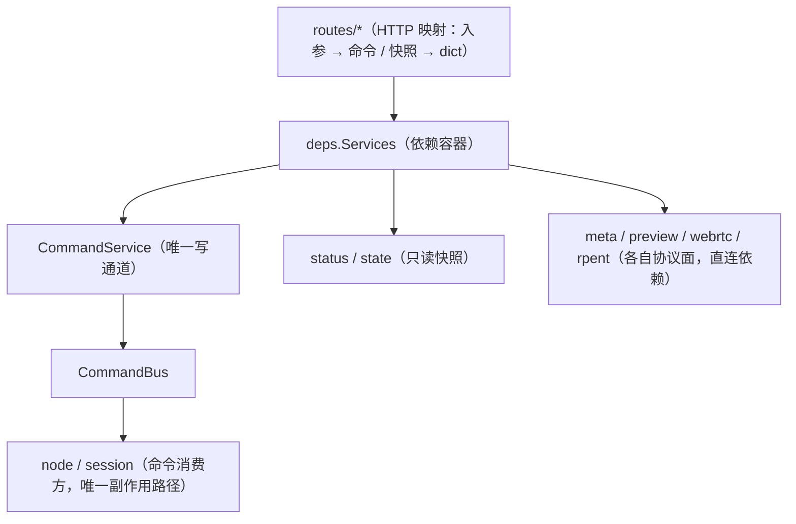

# HTTP 控制面（server）

## 摘要

`server/` 用 FastAPI 暴露 MotrixEdge HTTP 控制面（`/v1/*`）。**web 是 node 进程内的独立线程**：
`CommandService` 是**唯一写通道**，绑定「正在运行的 node 实例（只读状态来源）+ 共享
`CommandBus`」，经 `CommandBus.submit` 提交命令并**同步等待回执**驱动 EdgeNode，**不持有 / 不创建 /
不运行 node**（动作语义唯一实现在 session / node，web 只做命令提交与状态读取）。

**HTTP 与 CLI 走同一条命令路径**：每个写端点都映射为**一条命令**（与 CLI 逐条对应）；
`/v1/commands` 的 capability 只是命令词的另一种拼写（`robot execute` ↔ `robot/execute`）——
因此没有「只在 HTTP 侧存在的逻辑」，也没有「只在 CLI 侧存在的逻辑」。

## 目标与原则

-   **单点定义**：动作语义唯一实现在 session / node（命令的消费方）；server 只做「HTTP 入参 →
    命令参数」映射 + 只读快照。
-   **命令化驱动**：HTTP 动作经 `CommandService.submit` 同步等回执（`session run` / `session quit` /
    `infer rollout` …），无需轮询节点状态伪造同步。
-   **状态校验在消费方**：命令是否适用于当前状态由 node / session 判定（不适用 → 回执 `409`），
    不在 HTTP 层复制一套状态机；路由只做入参形状校验（如 prompt 非空、RTC 参数范围）。
-   **租约校验**：受控操作（enter / exit / preview / commands / webrtc / uploads）须持有 Edge 级
    活跃租约（`X-Lease-Id`，经 `LeaseManager` 校验）；只读操作（status / precheck / health /
    leases / captures meta）免租约。租约是 **HTTP 入口的权限门**：本地 CLI 不经 HTTP、因而
    不受租约约束 —— 这是 CLI 与 HTTP 的**唯一差异**，其余语义两端完全相同。
-   **未注入 → 501**：`create_app` 未注入所需依赖（node / CommandService / …）时对应端点返回 501。

## 模块分层与文件布局

依赖方向单向向下，**FastAPI 只出现在最上两层**（`app.py` 装配、`routes/*` 映射）：

| 文件                       | 职责                                                                                                                       |
| -------------------------- | -------------------------------------------------------------------------------------------------------------------------- |
| `app.py`                   | 应用装配：identity / 租约 / 上传会话的缺省构造、CORS 与 correlation / no-store 中间件、统一错误处理器、挂载各域 router     |
| `schemas.py`               | 请求 / 响应 Pydantic 模型（线上形状单点）                                                                                  |
| `deps.py`                  | `Services` 容器（router 工厂的唯一入参）                                                                                   |
| `routes/*`                 | 按域的 HTTP 映射（health / leases / commands / uploads / captures / infers / webrtc / rpent）；不含业务逻辑、不 try/except |
| `state.py`                 | node 只读视图（adapter 身份 / 心跳 / 采集状态）                                                                            |
| `status.py`                | 只读快照组装（`/v1/captures` · `/v1/infers` · `precheck`）                                                                 |
| `command.py`               | **HTTP 命令写通道** `CommandService`：`CommandDispatcher`（与 CLI 共用）+ 租约门 + capability / 回执映射                   |
| `meta.py`                  | 采集元信息选项（`CaptureMetaService`，直连 `CaptureMetaStore`；配置级、有意不经总线）                                      |
| `preview.py` / `webrtc.py` | 观测预览 / WebRTC 推流（各自协议面，不依赖 FastAPI）                                                                       |
| `rpent.py`                 | RPent 兼容 RPC facade（外部协议适配）                                                                                      |

-   **错误处理**：各层只抛 `ServiceError` 子类（基类在顶层 `motrix_edge/errors.py`：命令层
    `CommandError`、租约层 `LeaseError`、会话层 `UploadError`、服务层各 `*Error` —— 放顶层
    各层才能继承而不反向依赖）；`app.py` 注册**一个**处理器渲染成 `{"detail": ...}`，
    故路由层没有 try/except。
-   **路由总则**：所有 HTTP handler 一律同步 `def`（FastAPI 交给线程池），因为内部都是阻塞调用
    （`CommandBus.submit` 最长 5s、磁盘 / 文件操作、adapter 同步查询）；写成 `async def` 会占住
    uvicorn 事件循环，连带冻结 health / preview / WebRTC 信令。

## 端点总览

| 方法            | 路径                                                                                                                          | 说明                                                                                                                               | 服务               |
| --------------- | ----------------------------------------------------------------------------------------------------------------------------- | ---------------------------------------------------------------------------------------------------------------------------------- | ------------------ |
| GET             | `/v1/health`                                                                                                                  | 版本 / identity / 已绑定 adapter / 磁盘 / 时钟；`adapters.policies[].config_items` = 各策略的配置项 schema（前端据此动态渲染表单） | —（内建）          |
| GET             | `/v1/adapters`                                                                                                                | 静态列出全部注册适配器（不 discover / 不探活）                                                                                     | —（内建）          |
| GET/POST        | `/v1/adapters/config`、`/v1/adapters/current`                                                                                 | 运行时 adapter 能力配置（启用臂 / 相机；POST 须租约）                                                                              | EdgeNode           |
| POST            | `/v1/commands`                                                                                                                | 受控命令（capability 映射，须租约）                                                                                                | CommandService     |
| POST/GET        | `/v1/leases`、`/v1/leases/{id}:renew·revoke`、`/v1/leases/{id}`                                                               | Edge 级租约（Console 签发镜像）                                                                                                    | LeaseManager       |
| GET/POST/DELETE | `/v1/captures` + `/v1/captures/precheck`                                                                                      | 采集会话控制（写 → `session run/quit` 命令；读 → `status.py`）                                                                     | —（命令 + 快照）   |
| POST            | `/v1/infers` + `/v1/infers/rollout`、`/v1/infers/episode/start·end`、`/v1/infers/sync`、`/v1/infers/rtc`、`/v1/infers/config` | 推理会话控制（写 → 各条命令；读 → `status.py`）                                                                                    | —（命令 + 快照）   |
| GET/POST        | `/v1/uploads` + `/v1/uploads/*`                                                                                               | 本地 episode 扫描 / 选择 / 打包 + 上传队列                                                                                         | UploadSession      |
| GET             | `/v1/preview`                                                                                                                 | 最新观测预览（须租约）                                                                                                             | PreviewService     |
| POST            | `/v1/webrtc/offer`                                                                                                            | WebRTC 推流信令（须租约）                                                                                                          | WebRTCService      |
| GET             | `/v1/captures/meta`                                                                                                           | 采集元信息选项（前端选择列表，免租约）                                                                                             | CaptureMetaService |
| POST            | `/v1/captures/sync`                                                                                                           | 同步采集元信息到机器人进程（须租约）                                                                                               | —（命令）          |
| POST            | `/v1/infers/connect`                                                                                                          | 启动异步预热（infer connect；立即回执）                                                                                            | —（命令）          |
| POST            | `/call`                                                                                                                       | **RPent 兼容的 RPC 面**（外部 agent；`env.*` 子集，免租约白名单见下）                                                              | RpentService       |
| GET             | `/v1/rpent`                                                                                                                   | RPent 面自省：已实现方法 + 租约解析状态（免租约）                                                                                  | RpentService       |

correlation 中间件：`X-Correlation-Id` 贯穿请求与响应（缺省自动生成）。

## /v1/adapters（运行时能力配置）

运行时裁剪 adapter 能力（启用臂 / 相机）——能力裁剪语义见
[机器人适配器（adapter）](./motrix_edge_adapter.md) 的「能力裁剪」：

| 方法 | 路径                   | 租约 | 说明                                                                                                     |
| ---- | ---------------------- | ---- | -------------------------------------------------------------------------------------------------------- |
| GET  | `/v1/adapters/config`  | 无   | 节点运行时配置（`adapter_config`，可能尚未应用到 adapter）                                               |
| POST | `/v1/adapters/config`  | 必需 | 设置（可部分更新）并应用到当前已绑定 adapter；非法 → 400，状态不更新                                     |
| GET  | `/v1/adapters/current` | 无   | 当前绑定 adapter **实际生效**的启用臂 / 相机 / 动作维度 / home；**未绑定 → 404**（无机型信息，不猜默认） |

> 也可经命令走 `/v1/commands`（同一条实现路径）：`adapter config` / `adapter config set <json>` /
> `adapter config current`。`GET /v1/adapters`（静态注册表）见「端点总览」。

## /v1/commands（受控命令）

`POST /v1/commands` 请求体：`command_id` / `lease_id` / `capability` / `params` /
`idempotency_key`（**预留、未实现**：幂等去重尚未落地，字段仅回显；调用方需自行处理
重试，勿依赖去重）。`CommandService.execute` 先校验租约，再按 capability 映射为总线命令：

| capability         | 总线命令                                                                                  | 通道   | 说明                                                                          |
| ------------------ | ----------------------------------------------------------------------------------------- | ------ | ----------------------------------------------------------------------------- |
| `robot/estop`      | `robot estop`                                                                             | push   | 全局急停：安全停止 + 节点转 ERROR；走总线**旁路队列**，任务运行期间也即时生效 |
| `node/reset`       | `node reset`                                                                              | push   | 节点复位（ERROR → IDLE）                                                      |
| 其余全部已注册命令 | 同名词（`robot execute` / `infer rollout` / `infer rtc set` / `capture episode start` …） | submit | 同步等回执：成功回 `data`，业务拒绝 / 超时按 `status_code` 抛错               |

-   **capability 面 = 命令面**：除两条 push 型外，**任何已注册命令**都能经 `/v1/commands`
    提交（不再维护白名单——白名单曾带来「新增命令只对 CLI 生效」与「拼错 capability 静默
    accepted」两个坑）。未注册的命令词 → **404**。
-   参数形状与 CLI 同义：`params` 是**原生 JSON 值**（`{"enabled": false}`、`{"meta": {...}}`），
    命令侧解析函数（`parse_bool` / `parse_meta` …）同时接受 CLI 文本与原生值。
-   **来源标记**：`cmd.meta.source`（`cli` / `http` / `rpent`）**仅用于可观测性**（日志 / 排障），
    **不作为授权依据** —— 放行与否只看租约（`meta.lease_id`）。

capability 命名 `<scope>/<verb>`（scope = `robot` / `capture` / `infer` / `node` /
`lease` / `adapter`），由命令词派生（`command/naming.py::capability_for`，命令词是单一事实
来源，不手写第二张表）；回执的 `executed` 一律回**规范 capability**。旧拼写
（`robot_execute` / `estop` 一类）**保留一版**：仍可用，但回执带 `deprecated=true`
（调用方据此迁移）。完整映射与 RPent 对接见 [RPent 对接契约](./motrix_edge_rpent_bridge.md)。

## /call（RPent 兼容的 RPC 面）

外部 agent（RPent 一类：LLM 当大脑 + 冻 VLA 当小脑，多轮工具调用）经**单端点** `POST /call`
驱动 edge。请求体 `{method, args, kwargs, session_id}`；响应**始终 HTTP 200**，失败在 body 里用
`{"ok": false, "error", "kind"}` 表达（`kind` ∈ `lease` / `state` / `argument` / `unsupported` /
`unknown_method` / `internal`）；numpy 经 `__ndarray__` / `__npscalar__` tag 传输（与 RPent
`rpent/utils/rpc/http_rpc.py` 对称）。

| 方法                                                                                    | 说明                                 | 租约 |
| --------------------------------------------------------------------------------------- | ------------------------------------ | ---- |
| `healthz`                                                                               | 存活探针                             | 免   |
| `env.get_env_meta` / `env.get_camera_meta`                                              | 能力 / 相机自描述（agent 握手用）    | 免   |
| `env.get_observation` / `env.get_robot_state` / `env.get_task_language`                 | 观测（含相机帧 → uint8 RGB ndarray） | 必需 |
| `env.reset` / `env.step` / `env.chunk_step`                                             | 命令通道 + 逐帧 `adapter.rollout`    | 必需 |
| `env.move_delta` / `env.rotate_delta` / `env.set_gripper` / `env.recover_joint_posture` | 目标下发                             | 必需 |
| `session.register` / `session.close`                                                    | 确认收到（隔离载体是 Edge 级租约）   | 免   |

-   **租约由服务自行解析**（RPent 不认 `X-Lease-Id`）：`server.rpent.lease_id` 固定优先，
    否则取当前活跃租约；缺失 → `ok=false` + `kind=lease`。`server.rpent.step_hz` 控动作块
    逐帧下发频率（缺省用机器人上报的 `control_hz`）。
-   **启动自检**：`env.get_env_meta` 的 `lease` 段给 `required` / `state` / `expires_at` /
    `expires_in_s` / `reason`，`satisfied` 的语义是**租约现在可用**（能过 `require`，不只是
    “解析出了 id”）——外部 agent 连上就 `env.reset`（要租约），且租约 TTL 必须覆盖整轮 run，
    故要有字段能提前看出「没有租约 / 没生效 / 快到期」。租约权威在 Console，edge 只镜像与校验。
-   **外部动作块布局转换**（可选）：`server.rpent.action_layout: rpent/dual_franka` 把对方的
    20 维 `xyz + rot6d + 夹爪` 块转成 edge 每臂 `[xyz, rpy, gripper]` 绝对目标；
    `dry_run: true` → **任何下发都被拦住**（`step` / `chunk_step` 只回转换结果；`reset` 与四条
    写原语回 `sent: false` + `reached: null` + `reason: dry_run`；`_push_action` 兜底报错），
    真机联调先对数值、机器人不动；是否 dry-run 可从 `settle.dry_run` 看出。
-   **到位等待**：写原语（`move_delta` / `rotate_delta` / `set_gripper` / `recover_joint_posture`）
    默认阻塞到「误差 ≤ 容差」/ 超时 / 停滞（`server.rpent.settle.{pos_tol,rot_tol,timeout_s,stall_s,target_wait_s}`，
    默认 **5cm / 0.4rad（≈23°）/ 5s / 1s**（容差按 MIT 静态误差有意放宽），回执带 `reached` / `final_err`（+ 分项 `final_err_m` 位置米 /
    `final_err_rad` 姿态或关节弧度）/ `elapsed_s`（+ `stalled` / `timeout`）与生效容差
    `settle_pos_tol` / `settle_rot_tol`——外部 agent 靠它判成败，不等就会读到未动的那一帧，
    凭 `final_err` 与容差又能区分「还差一点」与「`stalled` 受阻」。**位置与姿态分别比容差**
    （不把米和弧度混进一个阈值）。**位姿增量（`move_delta` / `rotate_delta`）的到位参考取
    `observations/pose_target`**（机器人解算出的绝对目标）：下发后先等它从快照跃迁（命令走队列 + 观测
    按观察频率发布，不等就会拿旧目标当参考而误判到位），一直未跃迁 → `reached: null` +
    `not_applied`；跃迁后与「快照 + 增量」不符 → `base_changed`（基准被第三方改动）。
    可**逐次覆盖**：`settle=False` 不阻塞（`reached: null` + `reason`，
    仅流式场景用）、`settle={"timeout_s": 60}` 改单项（**上限 `max_timeout_s: 90s`**，超了会变成
    客户端 HTTP 超时异常）、非法类型 → `kind=invalid_params`。⚠️ 底层是 MIT 力矩控制（只有 P/D、
    `t_ff = 0`）→ **存在稳态误差**，容差必须按现场实测标定，见
    [RPent 桥接的 MIT 容差标定](./motrix_edge_rpent_bridge.md)。
-   **观测图分辨率**：`server.rpent.image_source: native`（默认）→ 直读 `adapter.observe()` 原图，
    并与同拍 qpos / pose 一起回（RPent 原样落盘 PNG 并内联给模型，小物体 / 夹爪间隙才看得清）；
    `preview` → 用 `FrameManager` 的 320×240 缓存。动作块逐帧观测面向 VLA，恒走缓存。
-   **不新增硬件契约**：读写都转发到 node / `CommandService` / `adapter`（与原生面同一份真相）；
    `shutdown` 不注册（edge 生命周期归 node / Console）。
-   方法映射与待对齐项（位姿编码 / 每臂状态块 / 图像分辨率 / `recover` 语义）见
    [RPent 对接契约](./motrix_edge_rpent_bridge.md)。

## /v1/captures（采集会话控制）

采集为**观测会话**：写端点（`POST` / `DELETE /v1/captures`、`/v1/captures/sync`）经
`CommandService` 提交命令（与 CLI 同名词），读端点（status / precheck / meta）直读快照或 store：

| 方法   | 路径                      | 租约          | 说明                                                                                                                                               |
| ------ | ------------------------- | ------------- | -------------------------------------------------------------------------------------------------------------------------------------------------- |
| POST   | `/v1/captures`            | 必需          | `enter`：`session run capture`（READY → ACTIVE，选择 + 启动一步）                                                                                  |
| GET    | `/v1/captures`            | 无            | 状态快照：node_state / session_type / session state / adapter（含遥操作位）/ **capture_status**（运行位 + 元信息全集 + 数据目录）/ disk / lease_id |
| GET    | `/v1/captures/precheck`   | 无            | 只读预检：节点 / 会话 / 机器人就绪 + 磁盘 + lease_id / leasable                                                                                    |
| GET    | `/v1/captures/meta`       | 无            | 采集元信息选项（`config/capture.yml` 的 `meta` 段，前端选择列表）                                                                                  |
| POST   | `/v1/captures/meta`       | 必需          | 选项管理：新增 `{key, value}`（分类不存在则创建）；重复 400                                                                                        |
| PATCH  | `/v1/captures/meta`       | 必需          | 选项管理：重命名选项 `{key, old, new}`；不存在 / 重复 400                                                                                          |
| DELETE | `/v1/captures/meta`       | 必需          | 选项管理：删除选项（`?key=&value=`，分类清空则一并删除该分类）                                                                                     |
| DELETE | `/v1/captures/meta/{key}` | 必需          | 选项管理：删除整个分类                                                                                                                             |
| POST   | `/v1/captures/sync`       | 必需          | `sync`：把选中元信息（`{operator, task_name, …}`）同步到机器人进程（进程保存数据时附加）                                                           |
| DELETE | `/v1/captures?lease_id=`  | 必需（query） | `exit`：`session quit`（ACTIVE → READY；**租约不随退出销毁**）                                                                                     |
| GET    | `/v1/preview`             | 必需          | 最新观测预览（qpos / action / pose 末端位姿 + 相机名 / 臂名；**不要求会话**，见 [FrameManager 与 WebRTC 推流](./motrix_edge_frame_webrtc.md)）     |

`POST /v1/captures` 响应：`{status: "accepted", state, lease_id, adapter}`（无请求体，单 adapter 包）。

> **采集数据归属（边界）**：`capture_status.data_dir` 为适配器 / SDK 进程自维护的
> **状态上报占位**——Edge 不驱动落盘、不校验、不上传（数据文件列表不经 HTTP 上报，
> 本地扫描 / 打包见 `/v1/uploads`）。实际数据落盘 / 校验 / 上传 **待完成**：后续按
> hardware adapter 契约完成 **CaptureBundle**（manifest / checksum → Local Spool →
> Uploader，服务端确认后才删），属 M11/M12（未在仓库内保留实施计划，落地时另行立项）。

## /v1/uploads（本地 episode 扫描与打包）

本地采集目录的 episode 扫描 / 查看 / 选择 / **打包**，由 `UploadSession` 实现（**不占**
RobotAdapter、不进节点任务状态机）；设计与字段见 [上传会话（UploadSession）](./motrix_edge_upload_session.md)。

| 方法 | 路径                 | 租约 | 说明                                                                                                                                                                               |
| ---- | -------------------- | ---- | ---------------------------------------------------------------------------------------------------------------------------------------------------------------------------------- |
| POST | `/v1/uploads`        | 必需 | 创建 / 重扫；body 可选 `folder_path`（须在白名单内），缺省回退 adapter 数据目录 → `upload.data_dir`                                                                                |
| GET  | `/v1/uploads`        | 必需 | 扫描汇总：episode 列表 / 状态 / 选择集 / 建议包名                                                                                                                                  |
| POST | `/v1/uploads/select` | 必需 | 按 `episode_ids` 替换选择集（只允许可选的 episode）                                                                                                                                |
| POST | `/v1/uploads/pack`   | 必需 | 把选中 episode **移动**到 `<扫描目录>/<包名>/`；重名 409、非法名 400、无扫描 / 无选择 409、源文件缺失 404、并发 409；收尾重扫失败 → `scan=null` + `warnings`（打包已成功，仍 200） |
| POST | `/v1/uploads/upload` | 必需 | 加入上传队列；**未配置 `upload.endpoint` → 501**                                                                                                                                   |
| POST | `/v1/uploads/retry`  | 必需 | 选择集中的失败项重置为 pending（未配置上传目标时不做网络传输）                                                                                                                     |

**受控操作**：uploads 端点全部要求 `X-Lease-Id`（读端点也要——扫描会读目录内容、打包会移动文件，
与 `/v1/preview` 同类）；缺失租约 `409` / 租约不匹配 `403`。

**目录白名单**：`folder_path` 只允许在**数据目录**（adapter 上报的采集目录 / `upload.data_dir`）
及其子目录内，越界 `400`；两个来源都没有 → `409`（不默认放开任意路径）。

**重操作互斥**：`scan` / `pack` 同时只允许一个在跑，并发 `409`（都要对整目录算 SHA-256 / 搬运文件，
避免拖住控制面）。

**并发模型**：`app.py` 里**所有** HTTP handler 都是同步 `def`（FastAPI 交给线程池），唯一的例外是
correlation 中间件（必须 `async def`）。原因：handler 内部全是**阻塞调用**——`CommandBus.submit`
同步等回执（最长 5s）、`scan` 算 SHA-256 / `pack` 搬文件、adapter 的同步 HTTP 查询；写在 `async def`
里会占住 uvicorn 事件循环，连带冻结 `/v1/health`、`/v1/preview` 与 WebRTC 信令。新增端点请沿用
同步 `def`。

> **当前范围**：上传 API 的**消费者是数据平台**，程序化上传在后续版本加入；本版本只做本地文件
> 的查看 / 筛选 / 打包，包目录由数采人员**手动上传**到数据平台（打包是**移动**：源文件进入包目录，
> 原位置不再保留）。

## /v1/infers（推理会话控制）

推理会话**无「多步推理」模式**：单步 / 持续推理经 `infer rollout` 驱动，推理时
**rollout 录制** = `capture episode start/end`（robot 不关心推理/采集）；写端点经 `CommandService`
提交命令（与 CLI 逐条对应），`GET /v1/infers` 读只读快照：

| 方法   | 路径                       | 租约          | 说明                                                                                                                                                                                                                                                                            |
| ------ | -------------------------- | ------------- | ------------------------------------------------------------------------------------------------------------------------------------------------------------------------------------------------------------------------------------------------------------------------------- |
| POST   | `/v1/infers`               | 必需          | `enter`：`session run infer`（可选 body `policy_type` / `config`——**整份策略配置**，含公共项端点 `host` / `port`，会话级：进入会话时固化）                                                                                                                                      |
| GET    | `/v1/infers`               | 无            | 状态快照：node_state / session / adapter / policy / connected / **warmed_up / warming / warmup_error / dropped_actions** / metadata / prompt / capture_meta / capture_status / rtc / policy_config（端点 host / port 与 warmup_required 在 `policy_config.items` 里）/ lease_id |
| POST   | `/v1/infers/connect`       | 必需          | `infer connect`：**启动 / 查询异步预热**（连接 + prepare + 取一块丢弃，不下发动作）；立即回执 `started` / `warming` / `warmed_up` / `warmup_error`，重复调用幂等；预热进度看 `GET /v1/infers`                                                                                   |
| POST   | `/v1/infers/rollout`       | 必需          | `infer rollout`：单步（缺省）/ `continuous` 持续推理，回执含 action                                                                                                                                                                                                             |
| POST   | `/v1/infers/episode/start` | 必需          | 开始一轮 rollout 录制（`capture episode start`，机器人按帧录 mcap）                                                                                                                                                                                                             |
| POST   | `/v1/infers/episode/end`   | 必需          | 结束一轮 rollout 录制（`capture episode end`，进程保存 episode）                                                                                                                                                                                                                |
| POST   | `/v1/infers/sync`          | 必需          | `capture sync`：同步采集元信息（默认 `operator=policy` / `task_name=prompt`）                                                                                                                                                                                                   |
| POST   | `/v1/infers/rtc`           | 必需          | `infer rtc set`：运行期设置 RTC 参数（可部分；非法 / 违反交叉约束 → 400）                                                                                                                                                                                                       |
| POST   | `/v1/infers/config`        | 必需          | `infer config set`：按**当前策略 schema** 设置配置项（含公共项端点 `host` / `port`，与其它项同一校验；未知键 / 类型不符 / 越界 / 必填为空 → 400）                                                                                                                               |
| POST   | `/v1/infers/prompt`        | 必需          | `infer prompt`：会话内预置 / 更新文本指令（需要 prompt 的策略）                                                                                                                                                                                                                 |
| DELETE | `/v1/infers?lease_id=`     | 必需（query） | `exit`：`session quit`（ACTIVE → READY）                                                                                                                                                                                                                                        |

## 状态读取（只读缓存）

`/v1/captures` 与 `/v1/infers` 的状态快照都含「当前节点绑定的 adapter」与「机器人进程采集
状态」两段，统一由 `server/state.py` 提供（`adapter_ref` / `adapter_state` /
`capture_status` / `capture_raw`）——**同一份字段定义，两个服务共用**，不再各自逐字段实现。

只读 `EdgeNode` 的**缓存**字段（adapter 身份与心跳 `running` / `control_hz` / `measured_hz`、
遥操作位 `teleop` / `teleop_mode`、采集 `running` / `meta`；由节点主循环周期刷新），**不**因
前端轮询触发对机器人进程的实时请求：edge 运行不依赖前端。

## 错误语义

**业务层只给 edge 错误码**（`motrix_edge.errors.ErrorCode`，见
[命令总线 · 命令对象](./motrix_edge_command_bus.md#命令对象)）；**HTTP 状态码由 HTTP 面自己维护**
（`app.py::_HTTP_STATUS`），并在响应体回传 code：`{"detail": "...", "code": "conflict"}`。

| edge 错误码        | HTTP | 出现场景                                                                               |
| ------------------ | ---- | -------------------------------------------------------------------------------------- |
| `invalid_argument` | 400  | 入参非法：prompt 为空 / 策略配置项非法键或必填项为空 / RTC 参数越界 / 未注册的策略类型 |
| `unknown_command`  | 404  | 未知命令（capability 解析出的命令词未注册）                                            |
| `not_found`        | 404  | 目标不存在（租约镜像 `{id}` / upload 目录 / episode）                                  |
| `conflict`         | 409  | 当前状态不适用（已在会话再 enter / 未在会话 exit / 节点未就绪 / 扫描已在进行）         |
| `lease_required`   | 409  | 受控操作未带租约（或租约尚未安装）                                                     |
| `forbidden`        | 403  | 租约不匹配（异租约）/ 已撤销                                                           |
| `lease_expired`    | 410  | 租约已过期                                                                             |
| `not_implemented`  | 501  | 服务未注入（create_app 未启用对应模块）                                                |
| `upstream_error`   | 502  | 策略端连接失败                                                                         |
| `unavailable`      | 503  | 依赖暂不可用（观测未就绪）                                                             |
| `timeout`          | 504  | 命令未被消费（submit 超时）/ WebRTC 协商超时                                           |
| `internal`         | 500  | 内部异常 / 失败回执漏给错误码（处理器疏漏）                                            |

## 相关文档

-   命令模型与传输：[命令总线（CommandBus）](./motrix_edge_command_bus.md)
-   会话语义：[会话（session）](./motrix_edge_session.md)
-   租约：[Edge 级租约（lease）](./motrix_edge_lease.md)
-   WebRTC 推流：[FrameManager 与 WebRTC 推流](./motrix_edge_frame_webrtc.md)
-   身份配置：设备身份（identity，`identity` 配置段见 [配置与命令行](./motrix_edge_config.md#配置加载)；
    经 `/v1/health` 上报）
-   代码入口：`src/motrix_edge/server/`（装配 `app.py` + HTTP 映射 `routes/*` + controller + `state.py`）
    —— 随 **feat/3**（HTTP 控制面）落地
