# robot-pipeline 位姿动作（求解器）

## 摘要

真机 Piper 只接受关节指令（`move_mit`）——SDK 的 `move_mit` / `move_j` / `move_p` 是**互斥运动
模式**，交替下发会逐帧互切、把力矩环的目标冲掉（详见
[robot-pipeline 运行时](./robot_pipeline_runtime.md)「为什么不用 `move_p`」）。因此**末端位姿控制
在机器人内部收敛为一次逆解**：`pose` / `pose_delta` 动作（每臂 `xyz + rpy`）先由
`robot/kinematics` 的求解器转成关节目标，之后与关节动作**走完全相同的通路**（`target_action`
限速插值 → `set_joint` → MIT 位置环）。底层控制模式、MIT 参数、观测键与 edge 契约都不变。

**下发只有关节角**：`set_joint` 只给 MIT 的 `p_des`，`kp` / `kd` / `t_ff` 全用缺省值。
⚠️ **本次位姿（阻抗）控制无力矩前馈**：MIT 环只有 `kp` / `kd`（P/D）与缺省 `p_des`，`t_ff = 0`、
`v_des = 0`——**不补偿重力 / 科氏 / 摩擦，也不做力控**；将来要加前馈 / 力控再按本文档扩充。

⚠️ **这条通路的精度上限 = MIT 的稳态误差**：控制器只有 P/D（`kp` 2–6、`kd` 0.4–1.0）、
`t_ff = 0`（**无重力前馈**），所以「设定什么关节就是什么关节」并**不成立**——关节会停在
`τ_gravity / kp` 附近的平衡点（负载 / 姿态不同则误差不同）。上位任何「到位」判定（edge 的
`settle`、RPent 的 `reached`）都必须按**实测稳态误差**设容差，否则会永远判不出到位；
两处相关说明见 [RPent 桥接的 MIT 容差标定](./motrix_edge_rpent_bridge.md)。

## 目标与约束

-   **底层不动**：机械臂始终只有一条控制通路——关节目标 + MIT（`p_des` / `v_des` / `kp` / `kd` /
    `t_ff`）；不引入第二套运动模式，不做模式切换。
-   **解算时机**：IK 只在**收到位姿目标时解算一次**（控制线程 drain 命令时），**不进 30Hz 控制环**
    ——`step()` 每拍做的仍是关节空间限速插值，与关节动作零差异。
-   **单位 / 坐标系与观测同源**：位姿是「米 + 弧度」，`R = Rz(yaw)·Ry(pitch)·Rx(roll)`，坐标系为
    法兰——且**位姿观测本身也由同一套 FK 给出**（`robot/kinematics` 的 `fk(q)`，不读 SDK
    `get_flange_pose()`）：调置方下发的目标与它读到的位姿在同一模型、同一系下可直接比较。
-   **失败要响**：目标不可达（超限位 / 解不收敛）时**拒绝该指令并回错**，绝不把「解不出来的位姿」
    当成关节角静默下发。
-   **零额外运行时依赖**：求解器只用 numpy（现场无需安装 pinocchio / CasADi，离线可单测）；
    位姿观测与 IK 共用控制器里的同一个 `PiperKinematics` 实例（模型必须同源，否则「看见的」与
    「算的」是两件事）。

## 契约

| 项       | 内容                                                                                                 |
| -------- | ---------------------------------------------------------------------------------------------------- |
| 动作空间 | `pose`（每臂 `xyz + rpy`，**绝对目标**）/ `pose_delta`（每臂 `xyz + rpy`，**增量**）                 |
| 维度     | 两空间**扁平维度相同**（双臂各 12），也与 `joint` 相同，差别只在每臂值的语义                         |
| 单位     | 位置米、姿态弧度、关节弧度                                                                           |
| 坐标系   | 法兰（与 `observations/pose` / `observations/pose_target` 同系，均由 `robot/kinematics` 的 FK 给出） |
| 缺省     | 不带 `action_space` 字段 = `joint`（向后兼容）；`pose_delta` 需机器人声明                            |

契约取值单点定义在 `motrix_edge.adapter`（`ActionSpace` / `FIELD_ACTION_SPACE`）；robot 侧用
**同名字符串常量**（`BaseRobot.ACTION_SPACE_JOINT` / `ACTION_SPACE_POSE` /
`ACTION_SPACE_POSE_DELTA`）匹配，值由 robot server 从契约透传，不另立一套取值。

## 位姿增量（`pose_delta`）

**增量叠加在机器人自己的关节段目标上**，不是实测位姿：

```
目标位姿   = FK(关节段目标) + [Δxyz, wrap(Δrpy)]
关节段目标 = IK(目标位姿, seed = 关节段目标)
```

-   **为什么不是实测**：底层是 MIT 力矩控制，实测关节恒落后目标一个稳态误差（`τ_gravity /
kp`，0.05–0.25 rad 量级）。以实测为基准时每一条增量都把当前误差写进新目标，$N$ 条累积
    $N·e$；更糟的是闭环：上位看到偏差再补一个小增量，下一条又把误差注入一次，**永不收敛**。
-   **为什么放机器人侧**：基准就是机器人自己的目标，机器人在**同一拍**读它 / 叠它 / 解它。上位
    即使能读到目标位姿再算绝对目标，也存在「读 → 算 → 写」窗口（遥操作接管 / CLI 直控 /
    另一个会话改目标）——窗口内目标一变就被旧基准覆盖。差值语义归机器人，这个窗口就不存在。
-   **rpy 相加**：与 `pose` 同坐标系 / 同单位，$rpy$ 在**同一 chart** 上相加并 wrap 到
    $(-\pi, \pi]$——小步长（VLA / RPent 的 delta 原语）下与旋转复合等价，故 `move_delta`
    （只给 $Δxyz$）与 `rotate_delta`（只给 $Δrpy$）可按轴独立下发。
-   **基准可观**：目标位姿由机器人常驻发布为 `observations/pose_target`（= `FK(关节段目标)`，见
    [动作空间与观测契约](./robot_pipeline_action_spaces.md)）——上位判到位（`settle`）拿它当参考，
    而不是自己攒基准。
-   **未声明即不支持**：`pose_delta` 是**声明式**能力（`ACTION_SPACES`）。旧机器人不声明时下发
    直接拒绝，**不会**被静默按实测位姿当基准处理。

<details>
<summary>改名历史（旧名 ``cartesian_pose``）</summary>

动作空间取值曾为 `joint` / `cartesian_pose`，因为“笛卡尔”是动作语义而非控制模式，现统一为
`joint` / `pose`（`ActionSpace.POSE`）。

</details>

## 运动学模型

`robot/kinematics/piper.py` 用 **Modified DH（Craig 约定）** 描述 Piper 六轴，纯 numpy 实现；
控制器以**静态函数**（`PiperController.joint_to_pose` / `pose_to_joint`）对外暴露，机器人层直接调用，
控制器本身**不持有**运动学状态：

$$
{}^{i-1}T_i = R_x(\alpha_{i-1})\,T_x(a_{i-1})\,R_z(\theta_i)\,T_z(d_i),\qquad \theta_i = q_i + \theta^{off}_i
$$

| 关节 | $\alpha$ | $a$ (m)   | $d$ (m) | $\theta^{off}$ |
| ---- | -------- | --------- | ------- | -------------- |
| 1    | 0        | 0         | 0.123   | 0              |
| 2    | $-\pi/2$ | 0         | 0       | $-172.22°$     |
| 3    | 0        | 0.28503   | 0       | $-102.78°$     |
| 4    | $\pi/2$  | -0.021984 | 0.25075 | 0              |
| 5    | $-\pi/2$ | 0         | 0       | 0              |
| 6    | $\pi/2$  | 0         | 0.091   | 0              |

参数与关节零位偏移来自 AgileX 官方教程；**末杆即法兰**（`link6`），与 `get_flange_pose()` 同系。

-   `fk(q)`：4×4 齐次变换（基座 → 法兰）；`pose(q)`：`[x, y, z, roll, pitch, yaw]`（按上文 rpy 约定
    反解，`pitch` 在主值域上取 `±π/2` 内的解）。
-   `jacobian(q)`：基座系几何雅可比（6×6，位置行 + 角速度行），与位姿误差的 `log`/欧氏表示配对使用。
-   **关节限位**：以官方规格为准（`PIPER_JOINT_LIMITS`，弧度）——IK 只做**软**限位（越界裁切），
    硬件保护仍由 SDK 的 `set_joint_limits_enabled(True)` 负责。
    **限位只有这一份**：解算（`_KINEMATICS`，模块级共享模型）与 `PiperController.set_joint`
    **下发前**的裁切用同一张表（**不经配置覆盖**），所以「解算的」与「下发的」永远同一范围
    ——不依赖「IK 解必在限位内」这个假设，关节动作（模型直出）也走同一道把关。现场要改限位就改
    `PIPER_JOINT_LIMITS`（安全边界，走 review），不做配置化。

## IK 求解器

`robot/kinematics/ik.py`：阻尼最小二乘（Levenberg–Marquardt）迭代；经
`PiperController.pose_to_joint(pose, seed, fallback_seeds=(), **ik_config)`（**静态**）暴露——
**只解算不下发**：机器人类拿 `IkResult.q` 写 `target_action`，再逐拍 `set_joint`。

-   **误差**：$e = \big[p_{des}-p_{cur};\ \log_3(R_{des}R_{cur}^{\top})\big]\in\mathbb{R}^6$（基座系）；
    收敛判据为位置误差 ≤ `pos_tol`（缺省 1e-4 m）且姿态误差 ≤ `rot_tol`（缺省 1e-3 rad）。
-   **更新**：$\Delta q = J^{\top}(JJ^{\top}+\lambda^2 I)^{-1}e$，$\lambda$ 为阻尼（缺省 1e-2，抑制
    奇异位形附近的大步长）；$\Delta q$ 按 `step_limit`（缺省 0.2 rad）裁切后 clip 到关节限位。
-   **种子**：机器人类传**当前指令位置**（`current_action()`，离目标近日与硬件同步），
    兜底 `init_joint` 段（`fallback_seeds`：仍不收敛时用 home 重试一次）。
-   **返回**：`IkResult`（`ok` / `q` / `pos_err` / `rot_err` / `iterations` / `reason`）——**成功才给
    `q`**；失败带原因（`max_iters` / `joint_limit` / `seed_unavailable`），由调用方决定语义
    （机器人类：失败 → `CartesianActionError` → 422，**不改既有目标**）。
-   **耗时**：单次求解是「矩阵迭代 ≤ `max_iters` 次」，与本机无关地保持在亚毫秒～毫秒级（离线可测），
    且**只在目标下发时发生一次**，不占控制拍预算。

## 链路与职责

```mermaid
flowchart LR
    E["Edge 调用方<br/>(rollout / primitives / RPent)"] -->|"action_space=pose"| A["adapter<br/>ACTION_SPACES 声明 + body 透传"]
    A -->|"/v1/rollout {action, action_space}"| S["contract_server<br/>ActionRequest"]
    S -->|入队| Q["env.commands"]
    Q -->|控制线程 drain| R["机器人类（编排）<br/>按臂拆包 → PiperController.pose_to_joint"]
    R -->|"每臂解算 → 关节目标"| T["target_action（关节空间）"]
    T -->|"step() 限速插值（每拍）"| C["controller.set_joint<br/>move_mit(p_des, ..., t_ff)"]
```



**职责边界（依赖方向 robot → controller → kinematics）**：

-   `robot/kinematics`：纯运动学 / 求解器（无硬件、无状态）；
-   `PiperController`：**只管关节 / 夹爪读写 + 限位把关**，并对外提供**静态**位姿转换
    （`joint_to_pose(q)` 正解 / `pose_to_joint(pose, seed)` 解算，只解算不下发）；
    `set_joint(...)` 只给 `p_des`（`kp` / `kd` / `t_ff` 用缺省值）；真机依赖只有
    `get_joint` + `move_mit`（不含 SDK 位姿读写）；
-   `BaseRobot`：**只有骨架** —— 目标状态机（`target_action`）、逐拍限速插值、遥操作映射、观测组装、
    `action_space` 校验；子类不覆盖 `_prepare_target()` 时只支持 `joint`；
-   机器人类（`DualPiperRobot` / `TestRobot`）：**编排**——`_prepare_target()` 里对 `pose` 逐臂调
    静态解算（起点 = 当前指令位置，兜底 home）→ 拼成关节 target；`get_observation_pose()` 用静态正解；
    `_apply_action()` 逐臂 `set_joint` / `set_gripper`；另加装配与声明（控制器 / 相机 / 类常量，
    `robot.cartesian.ik` 求解参数在这里解析后直接传给解算）。

`target_action` / `action` / 观测 `action` **始终是关节空间**，因此限速、遥操作、采集、观测链路零改动。

-   `contract_server`：`ActionRequest` 增加 `action_space`（缺省 `joint`），execute / rollout 透传到
    env；`/` 调试端点上报 `action_spaces`。
-   Edge：`DualPiperAdapter.ACTION_SPACES` 声明 `pose`，RPent 的 `move_delta` /
    `rotate_delta` 与 primitives 的 `goto` / `move_rel` 由此可用。

## 失败与安全

| 场景                        | 语义                                                                                                                   |
| --------------------------- | ---------------------------------------------------------------------------------------------------------------------- |
| 目标超出关节限位 / 解不收敛 | `CartesianActionError` → `/v1/rollout` 422；**不改 target**（保持上一目标不动）                                        |
| 未知动作空间 / 未接线       | `ValueError` → 422（edge 侧 adapter 先按 `ACTION_SPACES` 拦一次）                                                      |
| 关节动作（模型直出）越界    | 控制器下发前**逐关节裁到软限位** + WARNING（同一组超限只告警一条）——SDK 对越界值会报错并打印，先裁切就不给它报错的机会 |
| 位姿观测不可用（NaN）       | 写 NaN 位姿（下游丢弃该帧）；解算起点回退到 home 段                                                                    |
| 解算耗时异常（大位姿跳变）  | 单次求解有 `max_iters` 上限，最坏耗时有界；不在 30Hz 环里，不占控制拍预算                                              |
| 急停 / 遥操作               | 不经过解算：`safe_stop` 清目标、遥操作期间 `rollout` 仍被拒（既有语义）                                                |

## 标定与验证

DH 参数与关节读数方向必须与真机一致，验证方式（现场）：

1.  `robot-pipeline/scripts/verify_cartesian.py` 读若干位形，比较 `fk(q)` 与 `get_flange_pose()` 的
    位置 / 姿态误差（默认只读；`--cycles` 才小幅摆动）——偏差应在毫米级，否则先修正 DH 或关节符号。
2.  同一脚本可做往返（位姿 → 关节 → 正解 → 位姿）与「限位边界拒绝」冒烟。
3.  离线单测（`tests/test_piper_kinematics.py`）钉住 FK↔IK 自洽、rpy 往返、限位裁切与失败语义。
