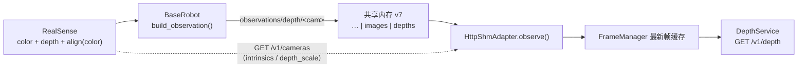

# robot-pipeline 深度观测（depth）

## 摘要

每台 RealSense 相机可以输出**对齐到彩色图**的 16 位深度图（单位由 `depth_scale` 给出，典型
0.001 m）。机器人进程把它**随观测一起发布**（共享内存新增深度区），Edge 侧暴露为
`observations/depth/<cam>`；反投影所需的**彩色内参**与 `depth_scale` 由机器人进程的只读元数据
端点 `GET /v1/cameras` 提供，Edge 侧缓存后经 `GET /v1/depth` 查询单个像素的**米**深度。

本文覆盖 **Phase 1：拿到深度**。**像素 → 机器人坐标**的反投影与手眼标定是 Phase 2（见文末）
——但本期的数据模型已带上反投影所需的全部输入（对齐深度 + 彩色内参 + `depth_scale`），
Phase 2 不必再改契约。

> **状态**：Phase 1 随「深度观测」MR 引入；Phase 2（手眼标定 / 坐标转换）见
> [统一坐标系与外参](./robot_pipeline_frames.md)（实现与工具已落地，**现场标定待做**）。

## 目标与约束

-   **只解决「这个像素有多远」**：像素深度以**米**给出；不做坐标转换（属 Phase 2）。
-   **深度对齐到彩色图**：采集侧做一次 `rs.align(rs.stream.color)`，使对齐后的
    `depth[v, u]` 与彩色图 `color[v, u]` 是**同一个物理点**——于是反投影只需要**一套彩色内参**，
    调用方不必记两套内参之间的外参。
-   **深度是观测**：走共享内存上行（与图像 / 状态同路），不是指令；查询不打扰控制循环
    （edge 读自己缓存的最新帧，不向机器人进程发请求）。
-   **不进数据集**：深度键前缀是 `observations/depth/`，采集器只收 `observations/images/`
    （见 [采集器](../../robot-pipeline/src/collector/mcap_collector.py)），故深度**天然不入 mcap**，
    数据集体积不变。要落盘再单独设计（16 位深度不能走 JPEG）。
-   **零新增依赖**：`pyrealsense2` 只在机器人端（既有依赖）+ numpy；Edge 侧只做数组索引。
-   **深度可选**：`robot.depth` 配置段可关深度（带宽 / 稳定性取舍），缺省开启该机型所有
    具备深度的相机。
-   **缺深度不致命**：机器人不提供深度时（`single_piper` / 配置关闭 / 元数据查询失败），
    图像与状态观测照常——深度只是少几个观测键，不是错误。

## 数据流



-   深度与彩色帧来自**同一次** `wait_for_frames()`（同一帧组），故同一拍、同一时间戳；
    对齐由 RealSense SDK 在同一次取帧里完成。
-   内参 / `depth_scale` 是**静态元数据**（对齐分辨率固定），故走 HTTP 一次性查询 + Edge 缓存，
    不占共享内存（共享内存的 header 是固定标量布局，放不下逐相机表格）。

## 契约

### 观测键

| 键                          | 内容                                                            |
| --------------------------- | --------------------------------------------------------------- |
| `observations/depth/<cam>`  | `uint16[H][W]` **对齐到彩色图**的深度图；`0` = 该像素无有效深度 |
| `observations/images/<cam>` | 彩色图（沿用既有契约，JPEG on edge）                            |

深度键**逐相机**出现，仅覆盖**生效的深度相机**（见「相机与配置」）；`depth[v, u]` 与
`observations/images/<cam>` 的**源分辨率**（`width` / `height`）像素一一对应——注意
`/v1/preview` 缓存的是降采样图，两者不是同一网格，故查询坐标用**归一化**值（见下）。

### 共享内存布局 v7

```
header | qpos | action | pose | pose_target | images | depths
```

-   新增 header 字段：`depth_count` / `depth_width` / `depth_height` / `depth_offset` /
    `depth_data_size`；
-   `depths` = `uint16[depth_count][H][W]` 连续排布，顺序 = 机器人**生效**的深度相机顺序
    （`IMAGE_NAMES` 的子序）；
-   同一块共享内存里，`images` 与 `depths` 按**相机名**对齐（两侧各按自己声明的顺序映射，
    count 不一致时显式报错，不静默错位）；
-   v6 及以前不兼容：reader 检测版本不符即报错（两端须同步升级 + 先重启机器人进程）。

### `GET /v1/cameras`（机器人进程 → Edge，只读元数据）

```json
{
    "cameras": [
        {
            "name": "cam_head",
            "width": 640,
            "height": 480,
            "intrinsics": { "fx": 605.1, "fy": 604.9, "cx": 320.5, "cy": 240.6 },
            "depth": { "scale": 0.001, "aligned_to_color": true }
        },
        { "name": "cam_left_wrist", "width": 640, "height": 480, "intrinsics": {...}, "depth": null }
    ]
}
```

-   `intrinsics` = **彩色内参**（对齐后深度图与彩色图共用同一像素网格；单位 = 像素）；
-   `depth.scale` = 深度原始值 → 米的比例（`depth_m = depth_raw × scale`）；
-   无深度能力的相机 `depth: null`（键仍出现，前端 / 调用方据此知道有哪些相机）；
-   静态元数据，Edge 侧惰性查询一次并缓存（不随观测每帧传输）。

### Edge 查询：`GET /v1/depth`

| 参数      | 说明                                                      |
| --------- | --------------------------------------------------------- |
| `camera`  | 相机名（须是生效的深度相机，否则 404）                    |
| `u` / `v` | **归一化**坐标 `[0, 1]`，相对该相机的源分辨率；缺省 `0.5` |
| 头        | `X-Lease-Id`（受控操作，与 `/v1/preview` 同规则）         |

响应：

```json
{
    "camera": "cam_head",
    "u": 0.5,
    "v": 0.5,
    "u_px": 320,
    "v_px": 240,
    "width": 640,
    "height": 480,
    "depth_raw": 1234,
    "depth_m": 1.234,
    "valid": true,
    "depth_scale": 0.001,
    "intrinsics": { "fx": 605.1, "fy": 604.9, "cx": 320.5, "cy": 240.6 }
}
```

-   **坐标用归一化值**：`/v1/preview` 与 WebRTC 推的是 320×240 降采样图，调用方在预览里点到的
    像素与源分辨率不是同一网格；归一化后两边一致（响应回显 `u_px` / `v_px` 便于核对）。
-   `depth_raw == 0` → `valid: false`、`depth_m: null`（RealSense 的 `0` 是**无效像素**，
    不是「距离 0」）。
-   返回 `intrinsics` / `depth_scale`：Phase 2 的反投影输入就在这里，调用方现在就能自己算
    `X = (u_px − cx) · z / fx` 等（本期 Edge 不算坐标，保持职责单一）。
-   只读已缓存的最新帧（`FrameManager`），不向机器人进程发起观测请求。

### 相机与配置

```yaml
robot:
    depth:
        enabled: true # 缺省 true；false = 完全不开深度流
        cameras: [] # 空 / 缺省 = 该机型所有具备深度的相机；给定则必须是其子集
```

-   「具备深度」是**机器人声明**（`BaseRobot.DEPTH_CAMERAS`，与相机型号一致：RealSense 有、
    网络摄像头没有）——不是现场接线，故内置；
-   生效集合 = `DEPTH_CAMERAS ∩ (配置给定的 cameras 或缺省全部)`，非法相机名 → 启动报错
    （与 `robot.ports` / `robot.cameras` 的「不猜」口径一致）；
-   Edge 侧的 `RobotAdapter.DEPTH_CAMERAS` 只作**能力声明**（`capabilities.observation_keys` /
    前端展示），**生效相机以机器人进程上报为准**（避免两端配置漂移）。

### 机型覆盖

| 机型                | 具备深度的相机                 |
| ------------------- | ------------------------------ |
| `dual_piper`        | 三路（均 RealsenseSensor）     |
| `dual_alicia_piper` | `cam_head`（两腕为网络摄像头） |
| `single_piper`      | 无相机                         |
| `test_robot`        | `cam_head`（**合成**深度）     |

`test_robot` 合成深度（与虚拟彩色帧同尺寸、确定性取值）→ 无硬件也能端到端验证
「共享内存 → adapter → `/v1/depth`」。

## Phase 2（手眼标定 / 坐标转换）——已由 [统一坐标系与外参](./robot_pipeline_frames.md) 落地

1. **手眼标定**：解外参——腕部相机为 eye-in-hand（`T_flange_cam`），固定相机为 eye-to-hand
   （`T_world_cam`）；标定产物落 `<根>/config/calibration/frames.json`（脚本与现场流程见该文档）；
2. **反投影 + 坐标变换**：`(u, v, depth) → XYZ_camera → XYZ_world`（用**同拍**位姿 + 外参）；
3. `GET /v1/depth` 已增 `xyz_camera` / `xyz_world` / `frame` / `world`（纯增量，原字段语义不变）；
4. 若需要「点云 / 区域查询」，再评估整帧端点（本期只做单点）。
