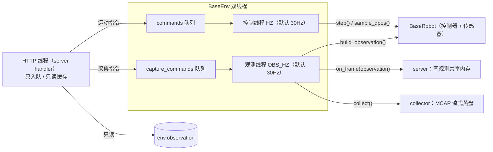

# robot-pipeline 运行时（控制 / 观测双线程）

## 摘要

robot-pipeline（仓库根 `robot-pipeline/`，独立 uv 子项目）在 robot server 进程内由 `BaseEnv`
驱动机器人：**机械臂控制与相机观测跑在两条独立线程**，相机或磁盘卡顿只让观测丢帧，不会拖慢
机械臂的限速步进。本文只描述 env / robot 这一层运行时；项目结构、硬件接入与 /v1 契约见
[robot-pipeline README](../../robot-pipeline/README.md) 与 [机器人适配器（adapter）](./motrix_edge_adapter.md)。

## 目标与约束

-   **控制节拍必须稳定**：`step_rad` 限速步进按固定频率下发，掉拍会让机械臂运动不连续。
    相机取帧（RealSense `wait_for_frames` 最长 5s、V4L2 `select` 0.2s）与 MCAP 落盘都可能阻塞。
-   **观测与机械臂状态同拍**：采集 / 推理需要"这一拍下发命令时的 qpos + action + 画面"。
-   **每个硬件组件单写者**：控制器 SDK、collector 都不是线程安全的，写者必须唯一。
-   **不新增 edge 侧契约**：观测键、health 字段继续复用 `motrix_edge.adapter` 的单点定义。

## 拓扑

-   **HTTP 线程**（server handler）只做两件事：把指令入队、读 env 缓存（`observe()` / `health()` /
    `capture_status()` / `data_status()`），不直接碰 robot 与 collector。
-   **控制线程**：消费运动指令 → `robot.step()` 限速接近 target → `robot.sample_qpos()` 采样机械臂状态。
-   **观测线程**：消费采集指令 → `robot.build_observation()`（缓存状态 + 本拍相机帧）→ 帧钩子
    `on_frame`（server 据此发布共享内存）→ 采集落盘。

## 线程职责

| 线程     | 频率             | 唯一写者                                                           | 消费队列           | 每拍动作                                       |
| -------- | ---------------- | ------------------------------------------------------------------ | ------------------ | ---------------------------------------------- |
| 控制线程 | `HZ`（30Hz）     | 机器人控制器 / `action` / `target_action` / `motion_state` / `seq` | `commands`         | 运动指令 → `step()` → `sample_qpos()`          |
| 观测线程 | `OBS_HZ`（30Hz） | collector / `observation`                                          | `capture_commands` | 采集指令 → `build_observation()` → 发布 → 落盘 |

指令分类固定：`robot_reset` / `robot_execute` / `robot_rollout` / `robot_safe_stop` /
`robot_set_teleop` 入 `commands`；`robot_capture_start` / `robot_capture_end` /
`robot_capture_sync` 入 `capture_commands`。两条队列各自只有一个消费者线程，FIFO 保证
`capture sync` 先于 `capture end` 生效。

## 观测组装（单点定义在 BaseRobot）

`BaseRobot` 持有观测键常量（`KEY_QPOS` / `CAMERA_PREFIX`）与两个**取数钩子**（子类实现，
返回原始数据，不含契约键 / 时间戳）：

| 钩子                       | 实现方       | 取数内容                                  | 所属线程 |
| -------------------------- | ------------ | ----------------------------------------- | -------- |
| `get_observation_qpos()`   | 各机器人子类 | 控制器读出的扁平 qpos                     | 控制线程 |
| `get_observation_images()` | 各机器人子类 | 各相机 raw RGB 帧（顺序 = `IMAGE_NAMES`） | 观测线程 |

在钩子之上，`BaseRobot` 提供按线程划分的入口：

-   `sample_qpos()`（控制线程）：调 `get_observation_qpos()`，附上 `action` / `timestamp`，`seq` 自增，
    结果**缓存**进 `motion_state`（机械臂侧状态快照）。
-   `capture_images()`（观测线程）：调 `get_observation_images()`，组装为
    `observations/images/<cam_name>`。
-   `build_observation()`（观测线程）：`motion_state` + 本拍相机帧；`motion_state` 为空
    （控制线程尚未采到第一拍）时返回 `None`，该拍不出观测，下一拍重试。
-   `get_observation()`（单线程脚本 / 调试）：`sample_qpos()` + `capture_images()` 现场取整帧。

⚠️ 相机取帧会阻塞，**控制线程不得调用取相机的方法**（`capture_images` / `get_observation`/
`build_observation`）；机械臂读取只在控制线程，观测线程只读 `motion_state` 快照。

## 频率与诊断

-   **频率**：`HZ`（控制线程）与 `OBS_HZ`（观测线程）是 `BaseEnv` 类常量，默认都是 30Hz；
    `OBS_SLOW_FRAME_S`（0.5s）为观测慢帧告警阈值。
-   **实测频率**：`measured_hz` = 控制线程最近 30 拍平均周期倒推；相机 / 落盘卡顿不影响它。
    `measured_observe_hz` = 观测线程实测频率，仅用于慢帧告警文案。
-   **慢帧告警**：观测拍耗时超过 `OBS_SLOW_FRAME_S` 时 `WARNING` 一条（最多每秒一条），带上耗时与
    当时观测实测频率，用于区分"相机卡顿"与"控制出问题"。
-   **ready 语义**：`health.ready` 要求机器人就绪、两线程存活、无指令执行错误；相机单帧异常只记日志，
    不置 `ready=False`（避免相机抖动把 Edge 打成 ERROR）。

## 停机与安全停止

-   `stop()`：置运行位为假 → join 控制线程（2s）→ join 观测线程（6s，可能正阻塞在相机取帧，
    最长 5s）→ `robot.disconnect()`。超时未退出的线程是 daemon，随进程退出。
-   `safe_stop` 语义不变：清空 `target_action`，`step()` 不再下发；线程与观测继续运行，可直接恢复。
-   **采集落盘边界**：`capture start/end` 在观测线程生效，`capture end` 在本拍**末尾**（写完本拍帧后）
    触发 `finish()`；相机卡顿时 episode 落盘相应延后。

## 与 Edge 的交互

-   控制面：Edge adapter 经 `/v1/*` 调用 env 的 `robot_*` / `capture_*` 方法，方法本身只入队并立即返回。
-   观测面：共享内存由 server 在 `on_frame` 回调中发布，发布频率等于观测线程频率；env 不碰共享内存。
-   健康面：`/v1/health` 的 `control_hz` / `measured_hz` 由 env 提供，字段契约单点定义在
    `motrix_edge.adapter.http_contract`。
